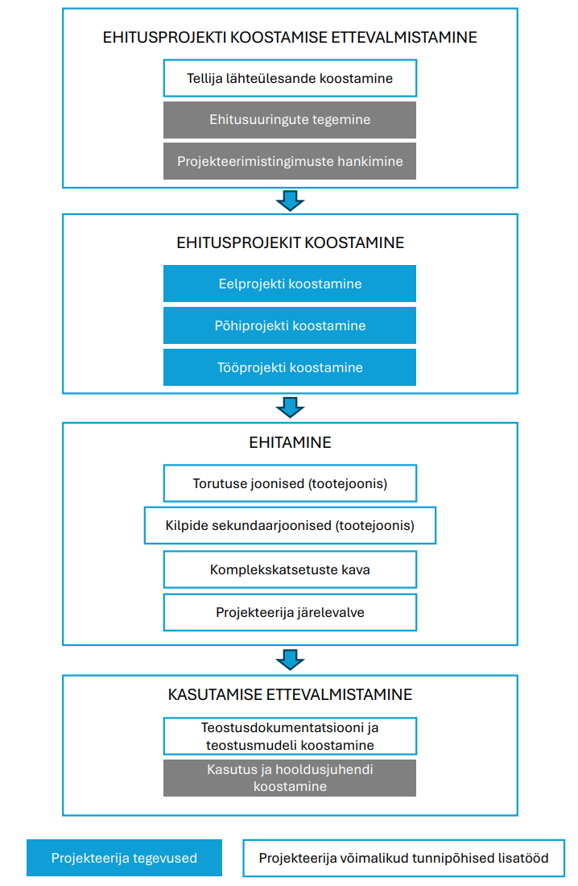

# 1.1 Juhendi eesmärk ja käsitlusala

## 1.1. Juhendi eesmärk ja käsitlusala

### 1.1.1. Miks see juhend on koostatud?

Käesoleva juhendi loomise peamine ajend on täiendada EVS-932:2017 olevaid nõudeid ning anda täpsem väljund nõuete rakendamiseks. Juhendi eesmärk on:

* **Ühtlustada kvaliteeti:** Luua ühtne arusaam heast projekteerimistavast ja kvaliteetsest projektdokumentatsioonist elektripaigaldiste valdkonnas Eestis.
* **Standardiseerida projektide mahtu ja sisu:** Määratleda selgemad piirid ja ootused dokumentatsiooni detailsusele ja mahule erinevates projekti staadiumites (EP, PP, TP).
* **Tõhustada koostööd:** Parandada kommunikatsiooni ja koostööd projekteerijate, tellijate, ehitajate, omanikujärelevalve ja teiste osapoolte vahel läbi ühiselt mõistetava raamistiku.
* **Pakkuda praktilist tuge:** Olla funktsionaalne ja kergesti mõistetav abivahend igapäevases projekteerimistöös.

### 1.1.2. Kellele juhend on mõeldud?

Juhend on mõeldud laiale sihtrühmale Eesti ehitussektoris, kuid peamisteks kasutajateks on:

* **Elektripaigaldiste projekteerijad ja insenerid:** Igapäevane töövahend projekteerimisülesannete täitmisel ja dokumentatsiooni koostamisel.
* **Peaprojekteerijad ja projektijuhid:** Abivahend projekteerimisprotsessi juhtimisel ja kvaliteedi tagamisel.
* **Tellijad ja arendajad:** Alusmaterjal projekteerimise lähteülesannete koostamiseks ja projektdokumentatsiooni kvaliteedi hindamiseks.
* **Ehitusettevõtjad:** Selgem arusaam projektdokumentatsiooni sisust ja oodatavast detailsusest.
* **Omanikujärelevalve teostajad:** Töövahend projekti vastavuse kontrollimisel.
* **Erialaliidud, kutsestandardite koostajad ja õppeasutused:** Sisend valdkonna arendamiseks ja õppematerjalide koostamiseks.

### 1.1.3. Mida juhend käsitleb?

Käesolev juhend käsitleb hoonete ja rajatiste elektripaigaldiste projekteerimise protsessi ning tulemusena valmiva ehitusprojekti dokumentatsiooni sisu ja vormistust. Juhend keskendub järgmistele põhiteemadele:

* **Projekteerimise etapid:** Nõuded ja soovitused eel-, põhi- ja tööprojekti (EP, PP, TP) koostamiseks vastavalt [EVS 932:2017](https://www.evs.ee/et/evs-932-2017) määratlustele.
* **Projektdokumentatsioon:** Ühtsed nõuded dokumentide (seletuskirjad, joonised, skeemid, spetsifikatsioonid, loetelud, arvutused) struktuurile, sisule ja vormistusele.
* **Tehnilised lahendused:** Parimad praktikad ja miinimumnõuded erinevate elektripaigaldise osade (tugevvool, nõrkvool, hooneautomaatika, tuleohutussüsteemide automaatika) projekteerimiseks.
* **BIM (Ehitise Infomudel):** Soovitused ja nõuded BIM-põhisele projekteerimisele elektripaigaldiste valdkonnas.
* **Kvaliteedi tagamine:** Protseduurid ja kontroll-lehed projekteerimise kvaliteedi kindlustamiseks.

Juhend **ei asenda** kehtivaid seadusi, määrusi ega standardeid (nagu [EVS 932](https://www.evs.ee/et/evs-932-2017), [EVS-HD 60364](https://www.evs.ee/et/evs-hd-60364-5-52-2011-a11-2017-consolidated) seeria jne), vaid **täiendab ja selgitab** neid, pakudes praktilisi juhiseid ja koondades valdkonna parimaid praktikaid. Juhend ei käsitle konkreetsete tootjate seadmete valikut ega asenda projekteerija erialast pädevust ja vastutust.

### 1.1.4. Elektriprojekti standardne töömaht ja eraldi tellitavad osad

Elektriprojekti standardne töömaht on arvestatud vastavalt standardile [EVS 932:2017](https://www.evs.ee/et/evs-932-2017) „Ehitusprojekt" ning täpsustavatele tingimustele. Käesolev juhend käsitleb tugevvoolu- (EL), nõrkvoolu- (EN) ja automaatikapaigaldiste (EAH) projekteerimist vastavalt peatükkides 4–7 toodud nõuetele.

Töömahtude selge piiritlemine on vajalik, sest:

* **Selge vastutusjaotus** — iga projektiosa eest vastutab vastava eriala pädev projekteerija. Piiritlemata töömaht tekitab olukorra, kus vastutus on hajus ja vead jäävad avastamata.
* **Topelttöö ja lünkade vältimine** — kui töömaht ei ole kokku lepitud, tehakse osa töid topelt ja osa jääb tegemata, sest kumbki osapool eeldab, et teine teeb.
* **Tellija teadlik otsustamine** — tellija saab lähteülesandes määrata, millised lisaosad on konkreetse objekti jaoks vajalikud, ja planeerida vastavat eelarvet.
* **Hinnaselgus** — enne ehitusprojekti koostamist ei ole võimalik prognoosida kõikide tootejooniste, sekundaarskeemide ja torutusjooniste mahtu, sest nende vajadus ja hulk selgub ehitusprojekti koostamise käigus.

#### Standardsesse töömahtu ei kuulu

Järgnevad tööd ja dokumendid **ei kuulu** elektriprojekti standardsesse töömahtu. Need on kas eraldiseisvad projekti osad, mis eeldavad erialaspetsiifilisi pädevusi, või lisadokumendid, mille vajadus ja maht selgub projekti käigus.

**Eraldi projekti osad:**

* **Valgustusprojekt (VA)** — valgustuslahenduse väljatöötamine (valgustite valik, paigutus, arvutused, juhtimislahendused) vastavalt [EVS 932:2017](https://www.evs.ee/et/evs-932-2017). Elektriprojekteerija vastutab valgustuse toiteahelate, kaabelduse ja kaitseaparatuuri eest (vt ptk 4.5).
* **Päikeseelektrijaama (PV) projekt** — paneelide paigutus, inverterite valik, tootlikkuse arvutused, kaitsesüsteemid ja võrguga liitumise tingimused. Ei kuulu elektriprojekteerija pädevusse. Elektriprojekteerija näitab skeemil PV-jaama ühenduskoha ja arvestab liitumispunkti mõjuga elektrivarustuse lahendusele (vt ptk 4.2). Koostab eraldi ettevõte spetsiaaltarkvaraga.
* **Energiatõhususe arvutused** — ei kuulu elektriprojekteerija pädevusse.
* **Audio-video esitlustehnika tehnoloogiline projekt** — ei kuulu elektriprojekteerija pädevusse, koostab eraldi spetsialiseerunud ettevõte.
* **Sideoperaatorite mobiilside projekt** — ei kuulu elektriprojekteerija pädevusse, koostab mobiilside operaator spetsiaaltarkvaraga.

**Tootejoonised ja lisadokumendid:**

Enne ehitusprojekti koostamist ei ole võimalik prognoosida tootejooniste koostamise mahtu — tootejooniste vajadus ja hulk (sh elektrikilpide sekundaarskeemid, torutusjoonised) selgub ehitusprojekti koostamise käigus.

* **Betoonelementide ja monoliitosade torutamise joonised** — valusse paigaldatavate torude, karpide ja maanduselementide paiknemine ja mõõdud. Elektriprojekteerija annab sisendinfo (torude trassid, mõõdud, tüübid), kuid torutamise joonised koostab konstruktor koostöös elektriprojekteerijaga.
* **Sekundaarahelate skeemid** — jaotuskeskuse sisesed juhtimis- ja signalisatsiooniskeemid (vt ptk 4.3).
* **Jaotuskeskuste laotised** — kilpide füüsiline komponentide paigutus (vt ptk 4.3).
* **DALI aadressitabelid** — valgustuse juhtimissüsteemi aadresside ja gruppide määramine (vt ptk 4.5).
* **Komplekskatsetuste tabelid** — vajadusel teostatakse eraldi tööna.

**Muud eraldi tellitavad teenused:**

* **Eskiisi etapi projekteerimine** — eskiisi etapp ja ehitusprojekti etapp eristatavad ehitise projekteerimise etapid. Teenust osutatakse tunnipõhiselt.
* **Projekteerija järelevalve teenus** — lähtuvalt [EVS 932:2017](https://www.evs.ee/et/evs-932-2017) lisa B ei ole võimalik prognoosida kogujakuluna; teenust osutatakse tunnipõhiselt.
* **Piksekaitse riskianalüüs** — standardi [EVS-EN 62305-2](https://www.evs.ee/et/evs-en-62305-2-2012) kohane riskihindamine. Vajadusel teostatakse eraldi tööna.
* **Materjalide kogused (mahuarvutus)** — kuulub vastavalt EVS 932 standardile ehituse eelarvestuse mahu hulka.
* **Teostusdokumentatsiooni koostamine.**

<figure markdown="span">
  
  <figcaption>Joonis 1. Elektriprojektiga seotud tegevuste ülevaade</figcaption>
</figure>

---

*Märkus: Konkreetse projekti töömaht ja eraldi tellitavad osad lepitakse alati kokku tellija ja projekteerija vahel projekteerimise lähteülesandes (vt ptk 2.2). Eraldi tellitavate osade täpsem sisu ning tööjaotus on kirjeldatud vastavates erialapeatükkides.*