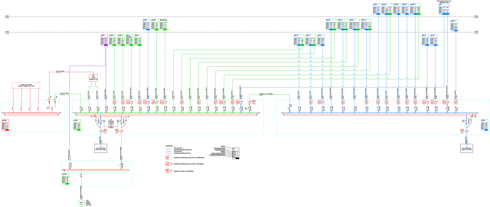
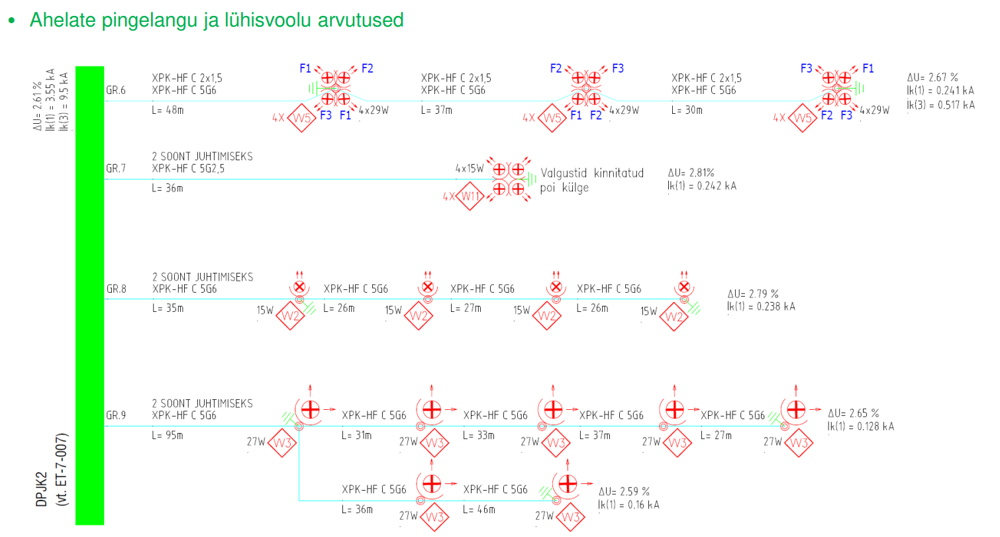
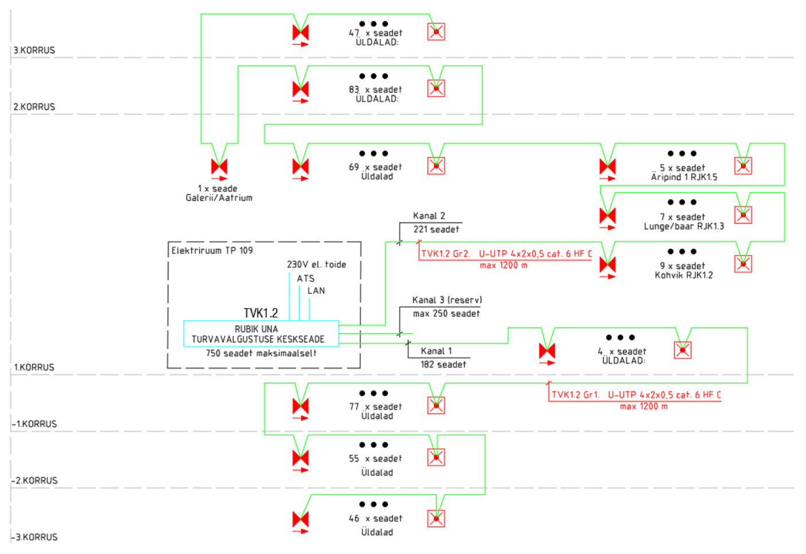
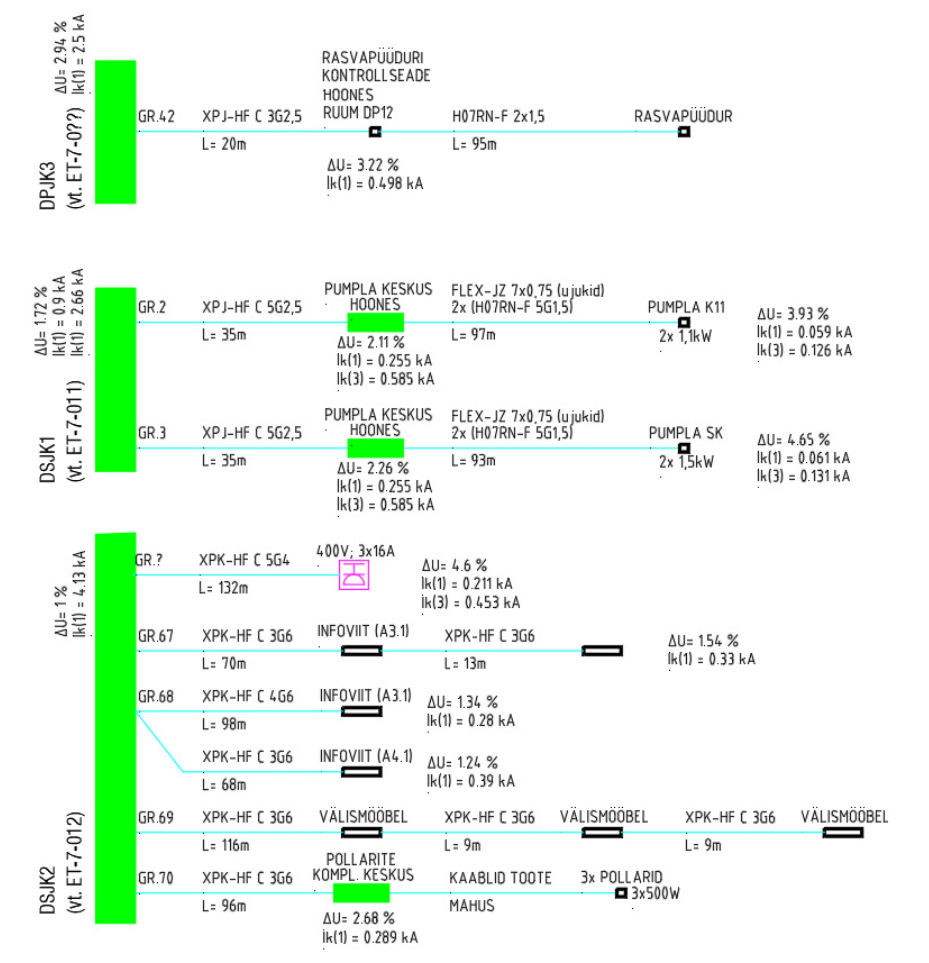
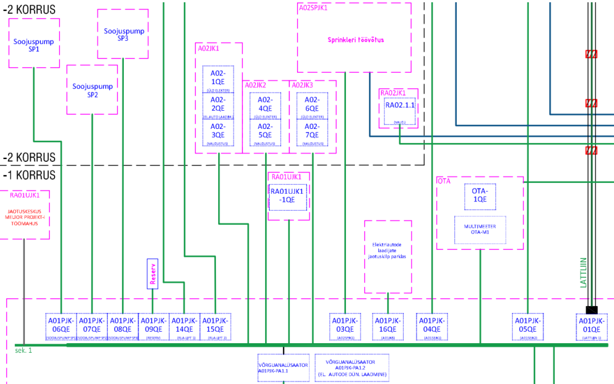
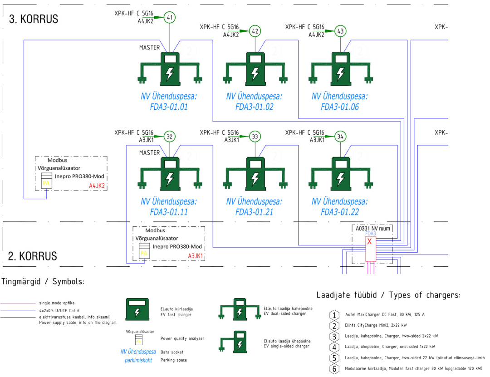

# 4.2 Skeemid

Skeemid on elektripaigaldise projektdokumentatsiooni oluline osa, mis annavad tervikliku ülevaate elektrivarustuse ja -jaotuse põhimõtetest. Nende hulka kuuluvad peamiselt elektrivarustuse skeem ja magistraalvõrkude skeem, mis võivad teatud projekteerimisetappides olla ka ühendatud. Need skeemid on aluseks detailsemate lahenduste väljatöötamisel ning tagavad süsteemi loogilise ja arusaadava esituse.

## 4.2.1 Üldnõuded skeemidele

Kõikidele skeemidele kehtivad järgmised põhinõuded, et tagada nende selgus, üheselt mõistetavus ja vastavus heale tavale:

* **Standardid ja normid:**
    * Skeemide koostamisel tuleb lähtuda kehtivatest standarditest, sealhulgas jooniste vormistamise üldnõuetest (nt [EVS-EN ISO 5457](https://www.evs.ee/et/evs-en-iso-5457-2001), [EVS-EN ISO 7200](https://www.evs.ee/et/evs-en-iso-7200-2004) kirjanurga kohta, EVS-EN ISO 3098 tekstide kohta) ning elektriskeemide koostamise standarditest (nt [IEC 60617](https://www.evs.ee/et/evs-iec-60617-2021) tingmärkidele, [IEC 61082](https://www.evs.ee/et/evs-en-61082-1-2015) dokumentide koostamisele).
    * Arvestada tuleb [määrusega "Nõuded ehitusprojektile"](https://www.riigiteataja.ee/akt/118072015007) ja standardiga [EVS 932:2017 "Ehitusprojekt"](https://www.evs.ee/et/evs-932-2017).
* **Vormistus ja loetavus:**
    * Kasutada standardseid või projektis defineeritud tingmärke. Kõik kasutatud tingmärgid peavad olema esitatud joonise legendis.
    * Teksti suurus joonistel peab tagama loetavuse ka vähendatud formaatidel, soovituslikult tähekõrgus 2.0–2.5 mm.
    * Kasutada selgeid ja eristatavaid joonetüüpe.
    * Skeemid peavad olema loogiliselt üles ehitatud ja kergesti jälgitavad.
* **Informatiivsus ja kooskõla:**
    * Skeemid peavad sisaldama piisavalt informatsiooni, et anda selge ülevaade süsteemi ülesehitusest ja toimimispõhimõtetest vastava projekteerimisstaadiumi detailsusastmes.
    * Kõik tähised (seadmed, kaablid, ruumid jne) peavad olema kooskõlas teiste projekti osadega (nt jaotuskeskuste skeemid, tasapinnaplaanid).
    * Failinimed peaksid järgima kokkulepitud konventsioone vastavalt peatükile 3.2.3. CAD kihtide kasutamisel järgida asjakohaseid standardeid (nt ISO 13567).

## 4.2.2 Elektrivarustuse skeem

Elektrivarustuse skeem (ka toiteskeem) kujutab elektripaigaldise toiteallikaid, liitumispunkti(e), peajaotusseadmeid ning nendevahelisi põhiseoseid. Selle eesmärk on anda ülevaade kogu objekti elektrivarustuse ülesehitusest.

* **Sisu nõuded staadiumite kaupa:**
    * **EP (Eelprojekti Staadium) :**
    * Liitumispunkti(de) asukoht (viide asendiplaanile) ja peamised parameetrid (pinge, maksimaalne lubatud vool/võimsus, lühisvõimsus liitumispunktis, kui teada).
    * Peamiste jaotuskeskuste (nt peakilp, olulisemad korrusekeskused) ühekordne kujutis ja nendevahelised peamised toitekaablid või -liinid (põhimõttelised, ilma detailse dimensioneerimiseta, kuid võib näidata eeldatava nimivoolu või suurusjärgu).
    * Varutoiteallikate (nt generaator, UPS) olemasolu ja põhimõtteline ühenduskoht süsteemis .
    * Omatoodangu allikate (nt PV-jaam) olemasolu ja põhimõtteline ühenduskoht .
    * Pingesüsteemi (nt TN-C-S, TN-S) märkimine.
    * **PP (Põhiprojekti Staadium) :**
    * Kõik eelprojekti staadiumi info täpsustatult.
    * Jaotusvõrgu struktuur kuni alajaotuskeskusteni.
    * Peamiste kaablite/lattliinide tüübid ja arvutuslikud ristlõiked/nimivoolud .
    * Peajaotusseadmete (sh peakilp) ja olulisemate jaotuskeskuste sisend- ja peakaitselülitite tüübid, nimivoolud ja lühisvoolutaluvus (Icu/Ics) .
    * Mõõtesüsteemide (arvestite) asukohad skeemis (kui ei ole eraldi arvestite skeemi).
    * Reaktiivenergia kompenseerimise seadmete asukoht ja põhimõte (kui on) .
    * Ülepingekaitsevahendite (SPD) tüüp ja asukoht peajaotuskeskuses.
    * **TP (Tööprojekti Staadium) :**
    * Kõik põhiprojekti staadiumi info täpsustatult.
    * Kõikide kaablite/lattliinide täpsed margid, ristlõiked ja paigaldusviisid (kui see mõjutab parameetreid).
    * Kõikide kaitseseadmete täpsed tüübid, nimivoolud, karakteristikud ja seadistusväärtused .
    * Selektiivsuse tagamise põhimõtted (võib olla viide eraldi arvutustele/tabelitele).
    * Täpsed ühenduspunktid ja klemmide tähised jaotuskeskustes (vajadusel).

## 4.2.3 Magistraalvõrkude skeem

Magistraalvõrkude skeem näitab detailselt peajaotusvõrgu jaotuskeskuste vahelisi kaableid/lattliine ja nende kaitseaparatuuri. Põhiprojekti ja tööprojekti staadiumis võib see olla integreeritud elektrivarustuse skeemiga, kui see ei halvenda loetavust .

* **Sisu nõuded staadiumite kaupa:**
    * **EP (Eelprojekti Staadium):**
    * Magistraalvõrkude skeemi eraldi esitamine on tavaliselt valikuline; põhimõttelised magistraalid kajastuvad elektrivarustuse skeemil .
    * **PP (Põhiprojekti Staadium):**
    * Jaotuskeskuste vahelised kaablid/lattliinid koos tüübi, ristlõike/nimivoolu ja ligikaudse pikkusega.
    * Kaableid/lattliine kaitsvad kaitselülitid jaotuskeskustes koos tüübi, nimivoolu ja seadistustega (ülekoormus ja lühisvoolu vabasti) .
    * UPS-i ja generaatori ühendused ning nendest toituvad magistraalid .
    * Elektri tootmis- ja salvestusseadmete (nt PV) ühendused magistraalvõrku .
    * Juhistikusüsteemi (TN-S, TN-C-S vms) kajastamine magistraalide osas .
    * Reaktiivenergia kompenseerimisseadmed kajastatakse .
    * *Märkus: Arvesteid magistraalliinide skeemil ei kajastata .*
    * **TP (Tööprojekti Staadium):**
    * Kõik põhiprojekti staadiumi info täpsustatult.
    * Täpsed kaablimargid, paigaldusviisid (kui mõjutab skeemi loetavust või tehnilisi parameetreid).
    * Kriitiliste liinide puhul pingelangu arvutuste tulemused (või viide).
    * Täpsed ühendusviisid ja klemmid jaotuskeskustes.

*Joonis 1. Magistraalvõrkude skeemi näidis.*

## 4.2.4 Muud skeemid

Vastavalt projekti spetsiifikale võib olla vajalik koostada ka muid üldistavaid ja süsteemidevahelisi seoseid selgitavaid skeeme . Nende sisu ja detailsusaste määratakse vastavalt konkreetsele vajadusele ja projekteerimisstaadiumile.

### Sisevalgustuse juhtimisskeemid

* **Eesmärk:** Kujutada sisevalgustuse juhtimise loogikat ja komponente.
* **Skeemil näidatakse (PP/TP staadiumis):**
    * Juhtimisseadmete (nt DALI kontrollerid, DMX liidesed, liikumis- ja kohalolekuandurid, hämardid, lülitid) põhimõtteline skeem.
    * Adresseeritavate süsteemide (DALI, DMX) puhul seadmete aadressid või adresseerimise põhimõtted.
    * DALI toiteseadmed kajastatakse kilbiskeemides.
    * Integreerimine hooneautomaatikasüsteemiga (kui on asjakohane).

#### 4.2.4.2. Välisvalgustuse skeem

* **Eesmärk:** Anda ülevaade hooneväliste valgustite toite- ja juhtimisahelatest.
* **Skeemil näidatakse (PP/TP staadiumis):**
    * Iga välisvalgusti identifitseerimine ja asukoht.
    * Toiteallikad ja kaabeldus iga seadme jaoks.
    * Ahelate pingelangu ja lühisvoolu arvutused.

<figure markdown="span">
  
  <figcaption>Joonis 2. Välisvalgustuse skeemi näidis</figcaption>
</figure>

#### 4.2.4.3. Evakuatsioonivalgustuse skeem — sisseehitatud akud ja monitooring

* **Eesmärk:** Anda ülevaade evakuatsioonivalgustuse monitooringu põhimõttest.
* **Skeemil näidatakse (PP/TP staadiumis):**
    * Evakuatsioonivalgustite monitooringu kaabelduse põhimõte.
    * Valgusti kogused korruste ja hooneosade lõikes.
    * Monitooringu keskseade ja sellest väljuvad kanalid ning valgustite arvud.

<figure markdown="span">
  
  <figcaption>Joonis 3. Evakuatsioonivalgustuse monitooringu skeemi näidis</figcaption>
</figure>

#### 4.2.4.4. Hooneväliste elektriseadmete skeem

* **Eesmärk:** Anda ülevaade erinevate hooneväliste seadmete (nt pumplad, tõkkepuud, teetõkised, elektriautode laadimispunktid, liiva-, õli- ja rasvapüüdurid, välisvaldkonna videokaamerad) toite- ja juhtimisahelatest .
* **Skeemil näidatakse (PP/TP staadiumis):**
    * Iga väliseadme identifitseerimine ja asukoht (viide vastavale tasapinnaplaanile).
    * Toiteallikad ja kaabeldus iga seadme jaoks.
    * Ahelate pingelangu ja lühisvoolu arvutused.
    * Juhtimisahelad ja signaalid (nt ühendus hooneautomaatikaga, kohalikud juhtimispunktid).

<figure markdown="span">
  
  <figcaption>Joonis 4. Hooneväliste elektriseadmete skeemi näidis</figcaption>
</figure>

#### 4.2.4.5. Potentsiaaliühtlustuse skeem

* **Eesmärk:** Anda ülevaade potentsiaaliühtlustuse süsteemist.
* **Skeemil näidatakse (PP/TP staadiumis):**
    * Peamaanduslatiga (PML) ühendatavate osade (nt metallist vee-, kütte-, gaasi-, ventilatsioonitorustikud, hoone metallkarkass, kaabliredelid) näitamine ja ühendusjuhtide põhimõtteline kulgemine.

#### 4.2.4.6. Laia maandussüsteemi skeem

* **Eesmärk:** Kujutada komplekssete või ulatuslike objektide maandussüsteemi terviklahendust, kui see on vajalik lisaks detailsetele maandusplaanidele.
* **Skeemil näidatakse (PP/TP staadiumis):**
    * Peamiste maanduselektroodide (nt vundamendimaandur, rõngasmaandur, süvamaandurid) jaotus ja omavahelised ühendused.
    * Peamiste potentsiaaliühtlustuslattide (PML) asukohad ja nendevahelised ühendused.
    * Ühendused erinevate hooneosade või rajatiste maandussüsteemide vahel.
    * Suuremate tehnoloogiliste seadmete või erinõuetega alade maandamise põhimõtted.

#### 4.2.4.7. Etapilisuse skeem

* **Eesmärk:** Selgitada elektripaigaldise rajamise ja kasutuselevõtu järjekorda etapiviisiliselt ehitatavatel objektidel.
* **Skeemil näidatakse (PP/TP staadiumis):**
    * Ehitusetappide piirid elektripaigaldise osas.
    * Ajutiste toiteallikate ja ühenduste asukohad ja parameetrid.
    * Püsitoitele ülemineku skeemid ja järjestus.
    * Iga etapi lõpus kasutuselevõetavate süsteemide ulatus.

#### 4.2.4.8. Arvestite skeem

* **Eesmärk:** Näidata elektrienergia arvestussüsteemi ülesehitust. Eraldi arvestite skeem on vajalik eelkõige keeruka arvestussüsteemiga objektide puhul (nt kui objektil on LEED või BREEAM rohemärgise nõuded, mitmeid arvestuspunkte või keerukas arvestusloogika). Lihtsamatel objektidel piisab arvestite kajastamisest elektrivarustuse skeemil ja kilbiskeemides.
* **Skeemil näidatakse (PP/TP staadiumis):**
    * Kõikide elektriarvestite (pea-, grupi-, alam-) asukohad ja tüübid.
    * Arvestite ühendamine jaotuskeskustesse.
    * Arvestite identifitseerimistähised.

<figure markdown="span">
  
  <figcaption>Joonis 5. Arvestite skeemi näidis</figcaption>
</figure>

#### 4.2.4.9. Elektriautode laadimise skeem

* **Eesmärk:** Kujutada elektriautode laadimistaristu elektrivarustust ja juhtimist.
* **Skeemil näidatakse (PP/TP staadiumis):**
    * Laadimispunktide (laadijate) asukohad, tüübid (AC/DC) ja võimsused.
    * Toiteahelad jaotuskeskustest laadimispunktideni, kaablite tüübid ja ristlõiked.
    * Dünaamilise koormusjuhtimise (DLM) süsteemi komponendid ja ühendused (kui on kasutusel).
    * Arvestuslahendused laadimiseks tarbitud energiale.
    * Andmesideühendused (nt keskhalduseks, maksesüsteemideks).

<figure markdown="span">
  
  <figcaption>Joonis 6. Elektriautode laadimise skeemi näidis</figcaption>
</figure>

---

*Märkus: Skeemid peavad andma selge ja üheselt mõistetava pildi elektripaigaldise ülesehitusest ning olema aluseks detailsemate projektiosade koostamisel. Terminoloogia ühtsus kogu projektis, sh skeemidel, on väga oluline. Skeemide sisu detailsusaste sõltub projekti staadiumist ja konkreetse objekti keerukusest.*

---
