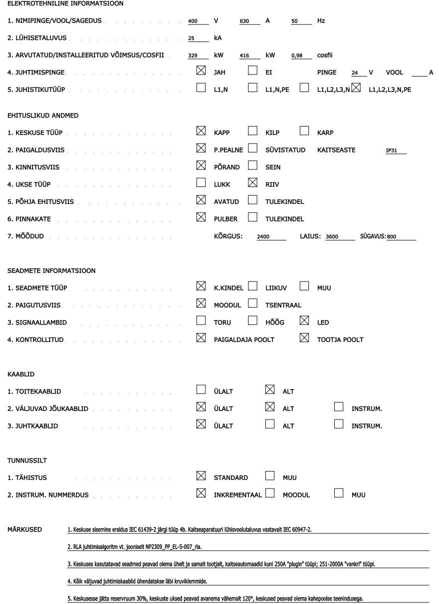
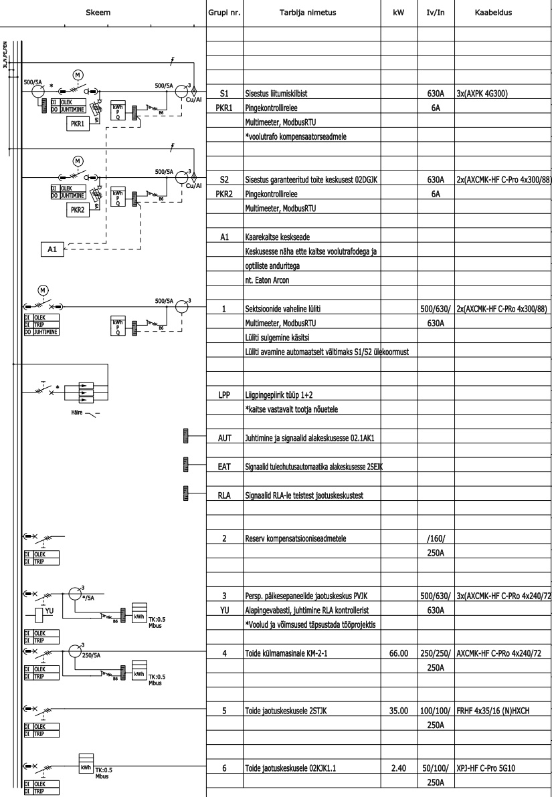
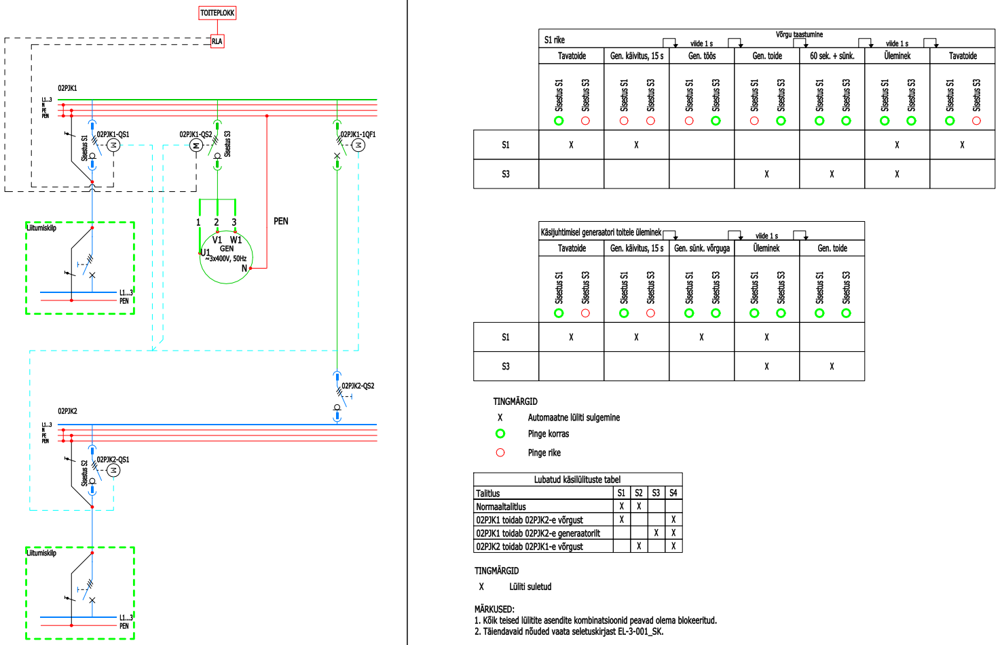

# 4.3 Jaotuskeskused (sh nõueteleht, skeemid, laotised)

Jaotuskeskused on elektripaigaldise keskne osa, mis tagavad elektrienergia ohutu jaotamise erinevatele tarbijatele. Nende korrektne projekteerimine, dokumenteerimine ja valmistamine on kriitilise tähtsusega kogu elektripaigaldise töökindluse, ohutuse ja hooldatavuse seisukohalt. Käesolev jaotis kirjeldab nõudeid jaotuskeskuste projekteerimisele ja nendega seotud dokumentatsioonile, sealhulgas nõuetelehtedele, skeemidele ja laotistele.

## 4.3.1 Üldnõuded ja standardid

* **Põhistandardid:** Jaotuskeskuste projekteerimisel ja valmistamisel tuleb lähtuda eelkõige järgmistest standarditest:
    * **[IEC 61439 seeria (EVS-EN 61439 seeria)](https://www.evs.ee/et/evs-en-iec-61439-1-2021):** "Madalpingelised lülitus- ja juhtimisseadmekomplektid". See standardisari määratleb jaotuskeskuste projekteerimise, ehituse ja katsetamise nõuded.
    * **[EVS-HD 60364 seeria](https://www.evs.ee/et/evs-hd-60364-5-52-2011-a11-2017-consolidated):** "Ehitiste elektripaigaldised", eriti osad, mis käsitlevad kaitset liigvoolu ja elektrilöögi eest ning seadmete valikut ja paigaldamist.
    * **IEC 60909 seeria:** "Lühisvoolud kolmefaasilistes vahelduvvooluvõrkudes" lühisvoolude arvutamiseks.
    * **IEC 60947-2** või **IEC 60898** kaitseaparatuuri lühisvoolutaluvuse kohta.
    * Vajadusel eristandardid spetsiifilistele paigaldistele (nt mere-, raudtee-).
* **Disainiprintsiibid:**
    * **Ohutus:** Tagada personali ja vara ohutus normaal- ja rikkeolukordades (kaitse elektrilöögi, lühise, ülekoormuse, kaarleegi eest).
    * **Töökindlus:** Tagada toiteallikate ja väljundite usaldusväärne toimimine, arvestades selektiivsuse ja varutoite nõudeid.
    * **Hooldatavus:** Võimaldada ohutut ja lihtsat juurdepääsu komponentidele hoolduseks, kontrolliks ja testimiseks. Sisemise eraldatuse vorm (nt 1, 2b, 3b, 4a, 4b vastavalt IEC/TR 61439-0) peab olema määratletud.
    * **Laiendatavus:** Arvestada tulevaste laienduste võimalusega (reservruum vähemalt 15–20%).
* **Kooskõlastamine:** Jaotuskeskuste projekteerimisel on oluline koostöö:
    * **Arhitekti ja sisearhitektiga:** Kilbiruumide asukohtade, suuruste ja juurdepääsude osas.
    * **KVVKJ projekteerijaga:** Kilpide soojuseralduse ja ventilatsioonivajaduse osas.
    * **Tellijaga:** Erinõuete, varutoitevajaduste ja juhtimisloogika osas.
    * **Hooneautomaatika projekteerijaga:** Andmesideühenduste ja juhtimissignaalide osas.

## 4.3.2 Jaotuskeskuse nõueteleht

Nõueteleht on keskne dokument, mis koondab jaotuskeskuse tehnilised ja ehituslikud nõuded ning on aluseks kilbi valmistajale ja hilisemale kontrollile. See esitatakse eraldi lehena enne skeeme.

* **Põhinõuded:**
    * Kilbi tähis (nimetus ja otstarve).
    * Nimipinge ja sagedus.
    * Nimivool (kilbi peasisendile).
    * Pingesüsteem (TN-C, TN-S, TN-C-S, IT jne).
    * Lühisvoolutaluvus Icw (nt 1s, kasutavad ka seadmete tootjad ja on võrreldav).
    * Kaitseaste (IP-klass).
    * Löögikindlus (IK-aste).
    * Kilbiehituse standard (viide IEC/EVS-EN 61439 osale, nt IEC 61439-1/-2/-3).
    * Vajadusel eristandardi nõuded (mere, raudtee jne).
    * Sisemise eraldatuse vorm (nt 1, 2b, 3b, 4a, 4b vastavalt IEC/TR 61439-0).
    * Installeeritud ja arvutuslikud võimsused (kilbi tootjale ebaoluline info).
* **Juhtahelate Andmed:**
    * Pinge ja sagedus (AC/DC).
* **Ehituslikud Andmed:**
    * Keskuse tüüp (kapp, kilp, klemmkarp).
    * Paigaldusviis (pinnapealne, süvistatav).
    * Kinnitusviis (põrand, sein).
    * Lukustuse tüüp (pöördlukuga, võtmega lukuga).
    * Kilbi värv (standardne või erinõue).
    * Keskuse kriitilised mõõdud (pikkus, laius, kõrgus, sügavus). PP staadiumis eeldatavad maksimaalsed mõõtmed, TP staadiumis valmistaja poolt antud täpsed gabariidid.
    * Piirangud transpordiühikule (nt madalad uksed).
    * Keskkonna temperatuuripiirid.
    * Reservruumi protsentuaalne nõue (nt 15–20%).
    * Uste avanemise suund ja nurk (vajadusel märkustesse).
* **Seadmete ja kaabelduse informatsioon:**
    * Latistuse materjal (Cu või Al, TP staadiumis täpsustatakse).
    * Signaallampide tüüp.
    * Juhtmestuse minimaalsed ristlõiked (jõuahel, juhtahel, DC ahel jne).
    * Juhtmestuse tüüpide värvid (L1, L2, L3, N, PE, juhtahela L, juhtahela N, DC +, DC- jne).
    * Kaablite sisendite ja väljundite suunad (alt/ülevalt/tagant jne).
    * Toitekaablite ühendusviis (otse aparaadiga või klemmidele).
    * Jõuväljundite ühendusviis (otse aparaadiga või klemmidele).
    * Juhtahelate ühendusviis.
    * Sisendi tüüp (nt lattsild, kaabel; kaabli tüüp ja mõõtmed, võib olla ka ainult skeemil).
* **Märkused:** Harva kasutatavad või väga spetsiifilised nõuded (nt lisakaitse nagu kaarekaitse, erinõuded viimistlusele, erinõuded kilbi sisemisele latistusele, soojuseraldus ja ventilatsioonivajadus) on soovitatav lisada märkuste lahtrisse, et hoida nõueteleht ülevaatlikuna.

*Joonis 1. Jaotuskeskuse nõueteliehe näidis.*

## 4.3.3 Skeemid

Jaotuskeskuste skeemid on peamine dokumentatsiooniosa, mis kirjeldab keskuse elektrilist ülesehitust ja funktsionaalsust.

#### Primaarskeemid (ühejooneskeemid)

Esitatakse kõikide pea- ja jaotuskeskuste kohta.

**PP staadiumis:**

* Latistuse nimetus ja juhistiku tähised (L(x), N, PE, TE jne)
* PEN lahutuspunkt (vajadusel)
* **Kilbi sisestused:** sisestuskoha nimetus, nimivool ja nimivõimsus, sisestuslüliti valik (koormuslüliti, kaitselüliti, sular jne), lülitusviisi määramine, mõõteseadmed (voolutrafod, mõõteseadmed, abiahelate kaitsmed), asendikontaktid, ühenduskaabel/latt, liigpingepiiriku vajadus ja valik, juhtsignaalide kirjeldus (vajadusel)
* **Kilbi väljundid:** tarbija tunnus ja nimetus, nimivool ja nimivõimsus, väljundlüliti tüüp (MCB, MCCB, RCD, AFDD, LSI valik), lülitusviisi määramine, mõõteseadmed, asendikontaktid, ühenduskaabel/latt, juhtsignaalide kirjeldus, juhitavate väljundahelate komponendid (kontaktorid, sagedusmuundurid, abireleed jne), juhtahelate komponendid ja releed
* **Indikatsioon ja lülitus:** indikatsioontulede kogus, juhtnupud ja nende tüüp
* **Muud komponendid:** trafod (primaar- ja sekundaarpinge, täpsusklass), abikontrollerid, pistikupesad kilbis sees ja kestal
* **Andmesideühendused:** kilpi sisenevad ja väljuvad andmesideühendused (siini tüüp/IO), kaablitüübid
* Lülitusseadmete ehitus (plug-in, vanker, fix)
* Lisakaitse (nt kaarekaitse)

*Joonis 2. Jaotuskeskuse ühejooneskeemi näidis (PP staadium).*

**TP staadiumis:**

* Kõik PP staadiumis esitatud info täpsustatuna
* Tähised
* Sätted (kõikide kaitseseadmete ja rikkekaitsete sätted)
* Aegreleede, pingekontrolli releede ja muu aparatuuri seadistuste sätted/viited
* Täpsustatud lülitusviis (käsitsi, ajamiga, ajami tüüp)
* Faseering
* Indikatsioontulede värvus ja funktsioon, tehase poolt esitatud parameetrid (pinge, AC/DC jne)
* Täpsustatud kaablitüübid (kaabli mark ja kogused) andmesideühendustele
#### Sekundaarahelate skeemid

* **Tootejooniste staadiumis** esitatakse kõikide ahelate skeemid detailselt: komponentide tähised, tehnilised parameetrid, klemmide tähised ja numbrid, välisühendused (sooned, tähised, ühendused klemmidega), juhtahelate sisemised ristlõiked ja soonte värvus.

!!! info "Lisatellimus"
    Sekundaarahelate skeemide koostamine ei kuulu standardsesse elektriprojekteerimise töömahtu ning üldjuhul koostab kilbi valmistaja. Tellija saab selle soovi korral tellida lisatööna tööde tellimuses.

    Kilpide sekundaarahelate skeemid on tootejoonised, mida saab koostada kui on lõppenud projekteerimise tööprojekti staadium ning ehitaja vastavate osade alltöövõtjad on välja valinud tarnitavad seadmed ja süsteemid.

    **Sekundaarahelate skeemide sisendandmed:**

    - Hooneautomaatika tööprojekt
    - Tugevvoolu osa kilpide tööprojekti primaarskeemid
    - Tugevvoolu osa tarnitavad seadmed ja süsteemid (ehitaja)
    - Tarnitavad KVVKJ seadmed ja süsteemid (ehitaja)

    Sekundaarskeemide mahtu on võimalik hinnata kui on olemas nimetatud sisendandmed. Üldjuhul teostatakse tunnitööna või tellitakse kilbitehasest, kes sel juhul vastutab komplektselt kilbi tootmise eest.

#### RLA loogika skeem (vajadusel)

Esitatakse maatriksina, kus on kirjeldatud juhitavad lülitid, lülituse käivitussignaal, viiteajad, lülitite olekud vastavalt sisendite olekule.

* **PP staadiumis:** juhitavad sisendid, sisendite olekud, viiteajad lülituste vahel, siirdeprotsess. Primaarskeemil näidatakse juhitavad lülitid tähistustega, toitekilbid, ajami tüüp, nimivoolud, latistus, tagasisideahelad, blokeeringud, käsijuhtimine.
* **TP staadiumis:** täpsustatud viiteajad, täpsustatud juhtimise maatriks, täpsustatud tähised ja nimivoolud, RLA kontrolleri valik ja tüüp.

*Joonis 3. RLA loogika skeemi näidis.*

#### Muud skeemid

* **Keskpinge jaotusseadme skeem (vajadusel):** Sisu täpsustatakse vastavalt projekti eripäradele.
* **Tingmärkide loetelu:** Skeemides kasutatavad tingmärgid peavad olema üheselt mõistetavad.

## 4.3.4 Jaotuskeskuste laotised (Layout)

Jaotuskeskuste laotised on joonised, mis näitavad komponentide füüsilist paigutust kilbis.

* **tootejooniste TP staadiumis:**
    * Kogu PP info täpsustatuna.
    * Kilbi kesta konfiguratsioon, avatavus, kinnitused.
    * Kaablite sisend- ja väljundavade asukohad ja mõõdud, läbiviikude arv ja läbimõõt vastavalt kaablitele.
    * Kilbi kestal ja/või uksel paiknevate indikatsioonide, näiturite, lülitite, seadenuppude ja sõrmistike täpne paigutus.
    * Kaabliteede paiknemine kilbis.
    * Kõikide kilbi komponentide (kaitselülitid, kontaktorid, klemmliistud, latid jne) täpne paiknemine kilbis.
    * Eestvaade, pealtvaade, vajadusel külgvaated ja sokli joonis.
    * Kilbi jahutuse ja ventilatsiooni lahendus (kui vajalik, arvestades soojuseraldusega).
    * Klemmliistude tähised ja numeratsioon.
    * Välisühenduste (kaablid, sooned, tähised) ühendused klemmidega.
    * Kasutatavate komponentide spetsifikatsioon (tüüp, nominaal, valmistaja kood, tehnilised parameetrid).
    * Indikatsioontulede värvus ja funktsioon.
    * Kõikide kaitseseadmete ja rikkekaitseseadmete sätted.
    * Aegreleede, pingekontrolli releede jm aparatuuri seadistuste sätted/viited.

!!! info "Lisatellimus"
    Jaotuskeskuste laotiste koostamine ei kuulu standardsesse elektriprojekteerimise töömahtu ning üldjuhul koostab kilbi valmistaja. Tellija saab selle soovi korral tellida lisatööna tööde tellimuses.

## 4.3.5 Dokumentatsiooni esitamine staadiumiti

| Staadium | Dokumentatsiooni sisu |
|----------|----------------------|
| **EP (Eelprojekt)** | • Jaotuskeskuste kontseptsioon (peamised parameetrid, asukohad, ruumivajadus) |
| **PP (Põhiprojekt)** | • Kõik EP mahus esitatu, täpsustatuna • Jaotuskeskuste nõuetelehed • Peajaotuskeskuse ühejooneskeem • Garanteeritud ja katkematu toite jaotuskeskuste ühejooneskeemid • Maandus- ja potentsiaaliühtlustuse skeem (keskustega seotud osas) • Vajadusel muud skeemid (nt RLA loogika skeem) • Installatsioonimaterjalide spetsifikatsioonid (sh kilpide osas) |
| **TP (Tööprojekt)** | • Kõik PP mahus esitatu, täpsustatuna ja detailiseerituna • Jaotuskeskuste nõuetelehed täpsustatud andmetega valmistajalt • Lõplikud primaarskeemid koos kõikide seadmete täpsete parameetrite ja sätetega • RLA loogika skeem (täpsustatud) • Komponentide spetsifikatsioonid (tüüp, nominaal, valmistaja kood, tehnilised parameetrid)

---

*Märkus: Jaotuskeskuste korrektne ja detailne projekteerimine ning dokumenteerimine on vältimatu eeldus ohutu, töökindla ja standarditele vastava elektripaigaldise ehitamiseks ja käitamiseks. Erilist tähelepanu tuleb pöörata standardi [IEC 61439](https://www.evs.ee/et/evs-en-iec-61439-1-2021) nõuete järgimisele ja koostööle kilbivalmistajaga.*

---