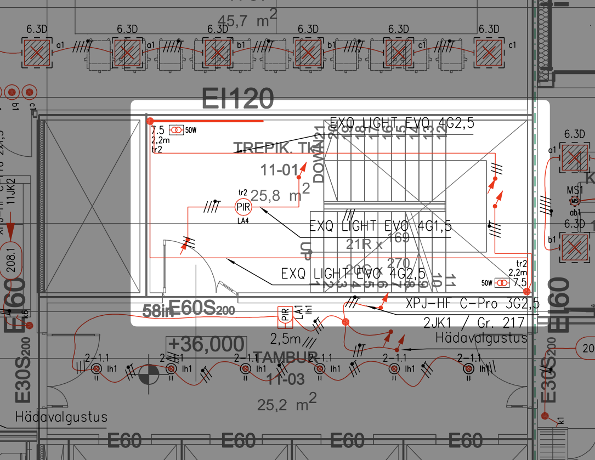

# 4.5 Valgustuse elektripaigaldis

Vastavalt [EVS 932:2017](https://www.evs.ee/et/evs-932-2017) on valguspaigaldise osa projekteerimine käsitletud eraldi projekti osana (VA), mida koostab valgustuse projekteerija. Käesolev peatükk käsitleb **elektriprojekteerija vastutusalasse** kuuluvaid valgustuse elektripaigaldise osi — toiteahelad, kaabeldus, kaitseaparatuur ja juhtimissüsteemide sidumine elektrikilpidega.

### 4.5.1. Elektriprojekteerija töömaht valgustuse osas

Elektriprojekteerija vastutab järgmiste valgustusega seotud töölõikude eest:

* **Valgustuse kaabeldus ja toide:**
    * Kaabelduse projekteerimine valgustuse projekteerija plaanide alusel    * Gruppide moodustamine ja numeratsioon
    * Koormusarvutused ja kaitsete valik
    * Kaablitüüpide ja paigaldusviiside määratlemine
* **Struktuurskeemid:**
    * DALI struktuurskeemid ja ühendusskeemid
    * DALI aadressitabelid
    * KNX või muude süsteemide skeemid
    * Hädavalgustuse struktuurskeemid
    * DMX struktuurskeemid (fassaadivalgustus, arhitektuurne valgustus)
* **Kilbilahendused:**
    * Valgustusgruppide kajastamine kilbiskeemides
    * Juhtimisseadmete (DALI kontrollerid, toiteallikad) kajastamine
    * Hädavalgustuse keskseadmete ühendused
    * Hämaraandurite ja programmkella ühendused (välisvalgustus)
* **Välisvalgustuse kaabeldus:**
    * Välisvalgustuse plaan kaabliteedega (TP staadiumis)
    * Kaablitüübid ja paigaldusviisid
    * Mastide ja vundamentide ühendusdetailid
    * Aluseks valgustuse projekteerija välisvalgustuse plaan
* **Tehnilised ruumid:**
    * Valgustite valik ja projekteerimine tehnoruumides, kilbiruumides, garaažides jm

### 4.5.2. Valgustuse kaabelduse plaanid

* **Üldvormistus:** Järgida ptk 3.4 nõudeid.
* **PP staadium:** Elektriprojekteerija eraldi valgustuse plaane ei koosta. Valgustuse toitegrupid kajastatakse kilbiskeemides.
* **TP staadium:** Valgustuse projekteerija plaanidele lisatakse kaabeldus, gruppide numbrid ja viited jaotuskeskusele.

*Näide valgustuse projekteerija sisendist (valgustite paigutus ja grupeeringud):*

*Näide elektriprojekteerija väljundist TP staadiumis (kaabeldus lisatud valgustuse projekteerija plaanile):*

### 4.5.3. Hädavalgustuse elektripaigaldis

* **Standard:** [EVS-EN 1838](https://www.evs.ee/et/evs-en-1838-2013). Arvestada tuleohutusosa projektis määratletud nõuetega.
* **PP staadiumis:**
    * Hädavalgustuse struktuurskeemid (kesktoitesüsteemi ülesehitus, liinide jaotus)
    * Kesktoitesüsteemi skeemid (keskaku, liinide koormused)
    * Tulekindlate kaablite trasside põhimõtteline kulgemine
* **TP staadiumis:**
    * PP mahu detailiseerimine valitud seadmete alusel
    * Aku mahtuvuse arvutused
    * Täpne kaabeldus (sh tulekindlad kaablid) keskseadmetest hädavalgustini
    * Seiresüsteemi ühendused
    * Keskaku liinide lõplikud koormuste arvutused
    * Kaitseseadmete lõplikud sätted

### 4.5.4. Valgustuse juhtimise struktuurskeemid

* **PP staadiumis** (esialgne struktuurskeem):
    * DALI struktuurskeem: süsteemi põhimõtteline ülesehitus, kontrollerite ja toiteallikate paiknemine, siinikonfiguratsioon
    * KNX või muude süsteemide struktuurskeemid (vajadusel)
    * DMX struktuurskeemid (fassaadivalgustus, arhitektuurne valgustus – vajadusel)
* **TP staadiumis** (detailiseerimine valitud toodete alusel):
    * PP skeemide täpsustamine konkreetsete valitud seadmetega
    * DALI ühenduskeem: seadmete ühendused siiniga, gruppide kuuluvus
    * DALI aadressitabel:
        * Iga adresseeritava seadme aadress (0–63)
        * Grupi kuuluvus (0–15)
        * Stseenide seaded ja tasemed
        * Seadme tüüp ja positsioonitähis
        * Asukoht (ruum, korrus)
        * Juhtimisliin (DALI liini number)
        * Märkused (nt päevavalguskompensatsioon, kohalolekuandur)
    * Lõplikud ühendusskeemid koos klemmide ja juhtmete tähistustega

!!! warning "Lisatellimus"
    DALI aadressitabeli koostamine ei kuulu standardsesse elektriprojekteerimise töömahtu. Tellija saab selle soovi korral tellida lisatööna tööde tellimuses.

### 4.5.5. Koostöö valgustuse projekteerijaga

* **Alusplaanid:** Elektriprojekteerija kasutab valgustuse projekteerija plaane alusplaanidena, mitte kopeerides.
* **Muudatuste haldus:** Valgustuse projekteerija plaanide muutumisel teavitatakse elektriprojekteerijat koheselt. Muudatuste mõju hindamine toimub ühiselt.
* **BIM koordineerimine:** Valgustuse mudel ja elektrimudel peavad olema kooskõlas. Regulaarne ristumiste kontroll ja probleemide lahendamine BCF formaadis.
* **Tööde piiritluse protokollimine:**
    * **Aeg:** Eskiis- või eelprojekti alguses
    * **Vorm:** Protokoll, lähteülesande lisa või projekteerimislepingu osa
    * **Olulised punktid:** Kes spetsifitseerib valgustid (ja millistes ruumides on erandid), kes koostab hädavalgustuse plaanid ja arvutused, kes vastutab juhtimiskontseptsiooni eest, kes koostab juhtimisskeemid, failide vahetamise kord ja formaat (DWG, IFC), versioonihalduse põhimõtted.

### 4.5.6. Dokumentatsiooni esitamine staadiumiti

| Staadium | Elektriprojekteerija väljund |
|----------|------------------------------|
| **EP** | Valgustuse elektritarbimisest tulenevate võimsuste arvestamine võimsuste bilansis |
| **PP** | Valgustusgruppide kajastamine kilbiskeemides, juhtimisskeemide koostamine (DALI, KNX), hädavalgustuse kesktoitesüsteemi skeemid |
| **TP** | Kaabelduse lisamine valgustuse projekteerija plaanidele, gruppide numeratsioon, DALI aadressitabelid, hädavalgustuse kaabeldus tulekindlate kaablitega, kaitseseadmete lõplikud sätted |

!!! note "Valgustuse plaanid"
    Üldjuhul elektriprojekteerija eraldi valgustuse plaane ei koosta — valgustuse plaanid koostab valgustuse projekteerija. Elektriprojekteerija lisab TP staadiumis valgustuse projekteerija plaanidele kaabelduse ja toitegruppide info.
