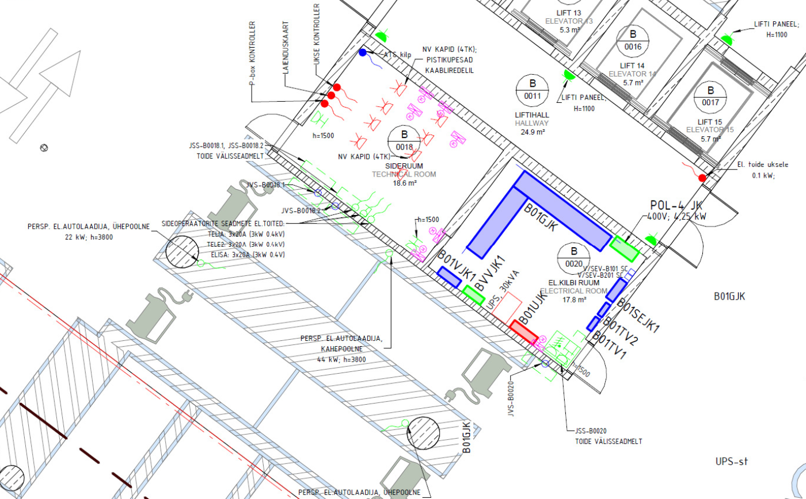
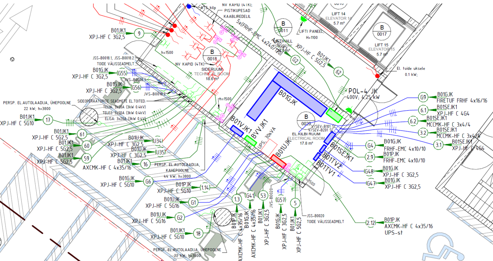

# 4.6. Jõupaigaldised

Jõupaigaldised hõlmavad laia spektrit elektritarbijaid alates üldkasutatavatest pistikupesadest kuni spetsiifiliste tehnoloogiliste seadmete ja hoone tehnosüsteemide (nagu küte, ventilatsioon, jahutus, veevarustus ja kanalisatsioon – KVVKJ) toideteni. Nende korrektne projekteerimine on hoone funktsionaalsuse ja ohutuse seisukohalt kriitilise tähtsusega.

## 4.6.1 Üldnõuded ja standardid

* **Põhistandardid:** Jõupaigaldiste projekteerimisel tuleb lähtuda eelkõige:
    * **[EVS-HD 60364](https://www.evs.ee/et/evs-hd-60364-5-52-2011-a11-2017-consolidated) seeria:** "Ehitiste elektripaigaldised" (eriti osad, mis käsitlevad kaitset liigvoolu, rikkevoolu ja elektrilöögi eest, seadmete valikut ja paigaldamist).
    * Asjakohased seadmestandardid (nt pistikupesade, mootorite, spetsiifiliste seadmete kohta).
* **Disainiprintsiibid:**
    * **Ohutus:** Tagada kaitse ülekoormuse, lühise, rikkevoolu ja elektrilöögi eest. Arvestada erinõuetega niisketes või plahvatusohtlikes ruumides.
    * **Funktsionaalsus:** Tagada kõikidele seadmetele piisav ja stabiilne toitepinge ning vajalik võimsus.
    * **Kasutusmugavus:** Pistikupesade ja lülitusseadmete loogiline ja mugav paigutus.
    * **Hooldatavus:** Seadmete ja ühenduspunktide hea ligipääsetavus hoolduseks ja remondiks.
* **Kooskõlastamine:** Jõupaigaldiste projekteerimine nõuab tihedat koostööd:
    * **Arhitekti ja sisearhitektiga:** Pistikupesade, lülitite ja muude nähtavate elementide asukohtade ja väljanägemise osas.
    * **KVVKJ projekteerijaga:** Kõikide KVVKJ seadmete (pumbad, ventilaatorid, küttekehad, jahutusseadmed, ajamid, automaatikakilbid jne) täpsete asukohtade, võimsuste, faaselisuse, käivitusvoolude ja juhtimisvajaduste osas.
    * **Tehnoloogia projekteerijaga (kui on):** Tehnoloogiliste seadmete (nt köögiseadmed, tootmisseadmed, meditsiiniseadmed) täpsete asukohtade, võimsuste ja erinõuete osas.
    * **Nõrkvoolu ja automaatika projekteerijatega:** Nende süsteemide seadmete (nt serverikapid, keskseadmed, kontrollerid) toiteallikate ja juhtimissignaalide osas.

## 4.6.2 Koormuste hindamine ja dimensioneerimine

* **Koormusandmed:** Täpsete koormusandmete (P, kW; In, A; cos φ; käivitusvoolud; üheaegsustegurid) kogumine kõikidelt ühendatavatelt seadmetelt on dimensioneerimise aluseks (vt ka ptk 3.7). See info saadakse tellijalt, arhitektilt (nt sisseehitatud mööbel), KVVKJ ja tehnoloogia projektidest.
* **Ahelate dimensioneerimine:** Iga pistikupesa grupp ja fikseeritud seadme toiteahel tuleb dimensioneerida vastavalt eeldatavale koormusele, arvestades kaabli ristlõike valikul voolu kestvat lubatavat väärtust, pingelangu, lühisvoolu taluvust ja kaitseseadme rakendumistingimusi.
* **Jaotuskeskuste dimensioneerimine:** Jaotuskeskuste sisendid ja väljundid dimensioneeritakse vastavalt ühendatud ahelate summaarsetele arvutuslikele koormustele.

## 4.6.3 Seadmete ja materjalide valik ning spetsifikatsioonid

* **Pistikupesad ja lülitusseadmed:** Valida tuleb vastavalt ruumi otstarbele, keskkonnatingimustele (IP-klass) ja ühendatavate seadmete tüübile (nt standardpistikupesad, CEE-pistikupesad, andmesidepistikupesad koos toitega, spetsiaalpistikupesad). Lülitid ja turvalülitid peavad vastama ühendatava seadme võimsusele ja ohutusnõuetele.
* **Fikseeritud seadmete toitepunktid:** Toitepunktid (nt harukarp, klemmenliist, turvalüliti, spetsiaalne pistikühendus) tuleb valida vastavalt konkreetse seadme paigaldusjuhendile ja võimsusele.
* **Kaabeldus ja paigaldustarvikud:** Valida sobivad kaablitüübid ja paigaldusviisid (vt ptk 4.4), arvestades koormust, keskkonnatingimusi, tuleohutusnõudeid ja esteetilisi kaalutlusi.
* **Spetsifikatsioonid (vt ptk 3.6):**
    * **PP staadium:** Määratleda pistikupesade, lülitite, turvalülitite, kaablitüüpide jms tehnilised ja kvaliteedinõuded.
    * **TP staadium:** Vajadusel täpsustada konkreetsete tootjate ja mudelitega.

## 4.6.4 Juhtimine

* Kuigi enamik pistikupesi on passiivsed, võivad teatud jõutarbijad vajada spetsiifilist juhtimist:
    * **Kohalik juhtimine:** Paljudel seadmetel (nt elektrikütte radiaatorid, boilerid, teatud mootorid) on sisseehitatud termostaadid või lülitid.
    * **Kaugjuhtimine/automaatika:** Teatud seadmete (nt KVVKJ seadmed, pumbad, valitud tehnoloogilised seadmed) tööd võidakse juhtida hooneautomaatika (EAH) süsteemi kaudu. Vajalik on tihe koostöö EAH projekteerijaga juhtimissignaalide ja -ahelate osas.
    * **Blokeeringud:** Ohutuse või funktsionaalsuse tagamiseks võivad olla vajalikud blokeeringud (nt KVVKJ seadmete seiskamine tulekahjusignalisatsiooni rakendumisel).

## 4.6.5 Jõupaigaldise plaanid

Jõupaigaldise plaanid koondavad kõikide elektritoidet vajavate seadmete ja süsteemide asukohad, toitepunktid ja kaabelduse. Plaanidel kajastatakse:

* Pistikupesad (üld-, IT-, jõupistikupesad)
* KVVKJ seadmete toited (ventilaatorid, pumbad, küttekehad, jahutusseadmed, klapiajamid, fancoilid jne)
* Elektrilised küttekaablid ja -radiaatorid (sh vihmaveetorude ja lehtrite küte)
* Lukustuse ja uste toited
* Nõrkvoolu osa elektritoited
* Hooneautomaatika ja tuleohutuse automaatika projekti osa toited
* Liftide, eskalaatorite ja muu tehnoloogia toited
* Köögitehnoloogia osa toited
* Audio-video tehnoloogia toited
* Sisearhitektuurse projekti osa toited

**Üldvormistus:** Järgida peatükis 3.4 toodud nõudeid. Kõikidel jõupaigaldise plaanidel peab olema näidatud toiteallikaks olevate kilpide asukohad ja nende teeninduspiirkonnad.

* **EP staadium:** Määratleda suuremate seadmete põhimõttelised asukohad, ligikaudsed võimsusvajadused ja erinõuetega tsoonid.
* **PP staadium:** Näidata kõikide elektritoidet vajavate seadmete täpsed asukohad ja toitepunktide tähised. Eristada erinevate toitesüsteemide (TAVA/GEN/UPS) seadmed (nt kihtide või värvidega). Pistikupesade asukohad kooskõlastada sisearhitektuurse lahenduse ja mööbli paigutusega. Näidata vajalikud turva- ja hoolduslülitid. Eraldi võib koostada elektrikütte plaanid.

<figure markdown="span">
  
  <figcaption>Joonis 1. Jõupaigaldise plaani fragment — põhiprojekti staadium</figcaption>
</figure>

* **TP staadium:** Kogu PP info + **kaabeldus** seadmetest jaotuskeskusteni; **gruppide numbrid** ja viited jaotuskeskusele; pistikupesade ja toiteotsade **paigalduskõrgused**. Vajadusel spetsiifilised paigaldusdetailid (nt jäätumissüsteemide paigaldusjoonised). Üldjuhul mõõtketid pistikupesadele ei lisata, kui need tulenevad sisearhitektuuri joonistest.

<figure markdown="span">
  
  <figcaption>Joonis 2. Jõupaigaldise plaani fragment — tööprojekti staadium</figcaption>
</figure>

---

*Märkus: Jõupaigaldiste projekteerimisel on eriti oluline täpne ja õigeaegne informatsioon teistelt projekti osadelt (arhitektuur, sisearhitektuur, KVVKJ, tehnoloogia), et tagada kõikide seadmete korrektne ja ohutu toide.*

---

## 4.6.7 Tabel: jõuplaanide sisu nõuded staadiumite kaupa

| Staadium | Sisu nõuded |
| -------- | ----------- |
| **EP**   | **Eelprojekt** (Fookus: kontseptsioon, põhimõtteline paigutus) - Suuremate KVVKJ ja tehnoloogiliste seadmete põhimõttelised asukohad. - Suuremate seadmete ligikaudne võimsusvajadus. - Toiteallikaks olevate kilpide asukohad (vastavalt detailsusastmele). - Kilpide teeninduspiirkondade näitamine. |
| **PP**   | **Põhiprojekt** (Fookus: detailne paigutus, tüübid, spetsifikatsioonid) - Kõikide pistikupesade täpsed asukohad, tüübid (üld-, IT-, jõu- jne) ja tähised. - Erinevate toitesüsteemide (TAVA/GEN/UPS) seadmete eristamine (nt kihtide või värvidega). - Pistikupesade asukohtade kooskõlastus sisearhitektuurse lahenduse ja mööbliga. - Kõikide KVVKJ seadmete ja muude fikseeritud eriseadmete täpsed asukohad ja toitepunktide tähised. - Vajalikud turva- ja hoolduslülitid seadmetele. - Elektrikütte plaanid (vajadusel eraldi). - Toiteallikaks olevate kilpide asukohad ja teeninduspiirkonnad. |
| **TP**   | **Tööprojekt** (Fookus: kaabeldus, ühendused, paigaldusinfo) - Esitada kogu **põhiprojekti (PP) staadiumi info**. - Kaabeldus kõikidest seadmetest ja pistikupesadest jaotuskeskusteni. - Gruppide numbrid ja viited jaotuskeskusele. - Pistikupesade ja toiteotsade paigalduskõrgused. - Spetsiifilised paigaldusdetailid (vajadusel, nt jäätumissüsteemide paigaldusjoonised).  *Märkus: TP staadiumis PP staadiumi lahendusi enam ei muudeta. Kui TP koostamise käigus ilmneb vajadus PP lahenduste muutmiseks, tuleb see teostada eraldi tööna PP staadiumi muudatusena.* |