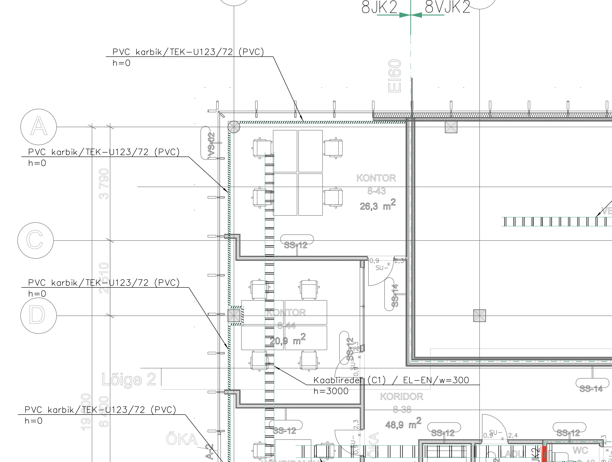
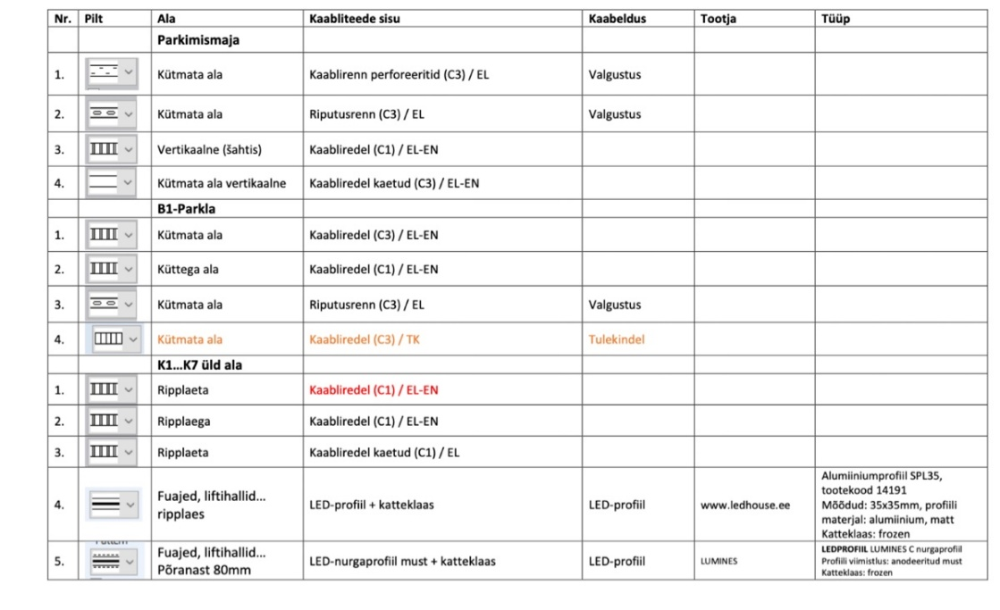
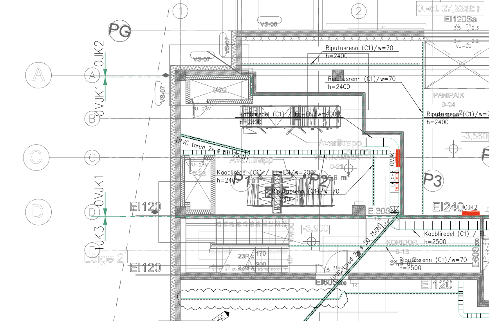

# 4.6 Kaabliteede plaanid

Käesolev jaotis kirjeldab nõudeid kaabliteede tasapinnaplaanide koostamisele elektripaigaldise projektides (tugev- ja nõrkvool). See hõlmab nii riputatavaid (laealused, seintel) kui ka põrandaaluseid kaabliteid.

## 4.6.1 Sisu nõuded staadiumite kaupa

**EP (Eelprojekti staadium):**

* Näidata **põhimagistraalide** (nii horisontaalseid kui vertikaalseid) asukohti ja ligikaudseid mõõtmeid/ruumivajadust.
* Määratleda **elektri- ja nõrkvoolu tehnoruumide** (sh kilbiruumid, serveriruumid) ning **šahtide** asukohad ja ligikaudsed suurused koostöös arhitektiga.
* Näidata **jaotuskeskuste** (pea-, korruse-) põhimõttelisi asukohti.
* Määratleda kaabliteede **tüübid** üldiselt (nt riputatavad, põrandaalused).

**PP (Põhiprojekti staadium):**

* **Riputatavad kaabliteed:** Näidata kõik kaabliredelid, -rennid, karbikud, tulepüsivad teed. Eristada tüübid (nt kaetud/katmata) ja süsteemid (EL/EN/TK) mustri või värviga. Markeerida lõigud (Tüüp / Laius / Esialgne kõrgus). Näidata ka lattliinid. Eristada erinevate keskkonnaklassidega kaabliredelid spetsifikatsiooni jaoks.
* **Põrandaalused kaabliteed:** Näidata põrandakarbid, põrandakanalid, tõstetud põranda alused teed.
* **Jaotuskeskused:** Näidata täpsed asukohad, tüübid (TAVA/GEN/UPS värvidega) ja teeninduspiirkonnad.
* **Avad:** Esitada avade ülesanne konstruktorile. Näidata vajalikud läbiviigud.
* **Tuletõkketsoonid:** Vajadusel näidata TT-tsoonid.

**TP (Tööprojekti staadium):**

* **Kõrgused ja mõõdud:** Näidata **täpsed paigalduskõrgused** (alumine serv) kõikidele kaabliteedele, sh kõrguse muutumisel. Lisada mõõdud põrandakarbid ja muude väljaviikude mõõtmed. Määratleda kilpide täpsed gabariidid ja teenindusalade mõõtmed. Üldjuhul mõõtahelaid seadmetele ei lisata, v.a erijuhtudel.
* **Kaabeldus:** Näidata **põhimagistraalide kulgemine** kaabliteedel kas kaablite või kaabligruppide (pakkide) kaupa.
* **Sõlmed ja detailid:** Keerukamate kohtade ja ristumiste detailid on vaadeldavad BIM mudelist.
* **Avad:** Näidata lõplikud ehituslikud avad, mis tuleb tekitada.

## 4.6.2 Markeerimine ja tähistus

* **Kaabliteed:** Iga kaablitee lõik (eriti riputatav) peab olema varustatud viitega/tähisega, mis sisaldab vähemalt:
    * **Kaablitee tüüp:** (nt redel C1, renn C3, karbik K1, TK-tee jne)
    * **Süsteem:** EL (tugevvool), EN (nõrkvool), TK (tulepüsivad kaabliteed) — võib olla ka värvi/mustriga.
    * **Laius (w):** millimeetrites (nt w=300)
    * **Paigalduskõrgus (h):** Alumise serva absoluutkõrgus või kõrgus nullist (nt h=2400). Näidata kõrguse muutuskohtades.
    * *Näide viitest:* Redel (C1) / EL / w=300 / h=2400
* **Jaotuskeskused:** Tähistada vastavalt projektis kasutatavale süsteemile (nt JK1, PK, UPS-JK2). Eristada värviga tava-, gen.- ja UPS-toite kilbid.
* **Tingmärgid:** Kasutada standardseid või projektis defineeritud tingmärke. Kõik kasutatud tingmärgid peavad olema esitatud joonise legendis.

## 4.6.3 Näited

* Näide riputatavate kaabliteede markeerimisest.

* Näide süsteemide eristamisest mustritega.

* Näide kilbi teeninduspiirkonna ja tähistuse kohta.

* Näide kaablipakkide kujutamisest (TP).

## 4.6.4 Märkused ja head tavad

* Kaabliteede planeerimisel arvestada teiste tehnosüsteemide (KVJ ja VK torustikud, ventilatsioonikanalid jne) paiknemisega ja ruumivajadusega. Koostöö teiste projekti osade projekteerijatega on kriitilise tähtsusega.
* Tulepüsivate (TK) kaabliteede paiknemise planeerimisel tuleb arvestada, et tulekahju korral ei kukuks neile peale tulepüsivuseta paigaldised (nt tavalised kaabliredelid, KVJ ja VK torustikud, ventilatsioonikanalid, ripplagede konstruktsioonid). Tulekahjus deformeeruvad ja varisevad konstruktsioonid võivad katkestada tulepüsiva ahela ka siis, kui kaabel ise on tulele vastupidav. Tulepüsivad kaabliteed paigaldada eelistatult eraldi tasandile (näiteks alla teiste paigaldiste või eraldi šahti) või muul moel kaitstuna.
* Kaaluda kaabliteede täituvuse ja kandevõime arvutamist/hindamist keerukamate objektide puhul (eriti PP/TP staadiumis).
* Tööprojektis võib olla otstarbekas näidata kaablite järjestus kaabliteedel suuremate magistraalide puhul.
* Dokumenteerida ja kooskõlastada kõik avade ülesanded konstruktoriga õigeaegselt.
