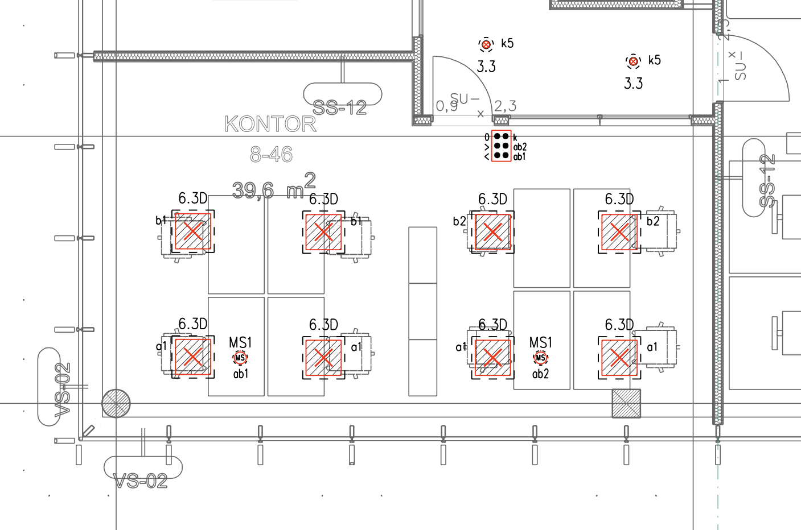
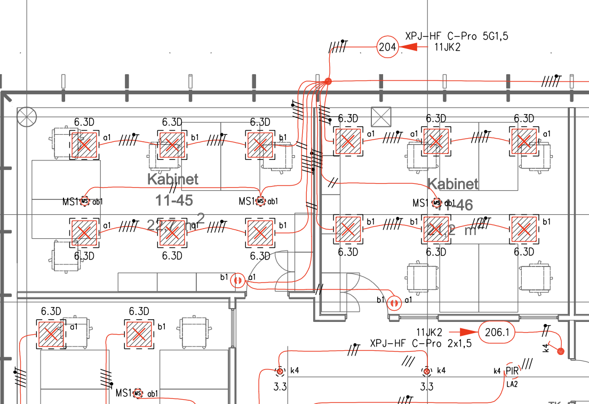

# 4.7 Valgustuse toiteplaanid

Vastavalt [EVS 932:2017](https://www.evs.ee/et/evs-932-2017) ptk 9.15 on valguspaigaldise osa projekteerimine käsitletud eraldi projekti osana (VA), mida koostab valgustuse projekteerija. Käesolev peatükk käsitleb **elektriprojekteerija vastutusalasse** kuuluvaid valgustuse elektripaigaldise osi — toiteahelad, kaabeldus, kaitseaparatuur ja juhtimissüsteemide sidumine elektrikilpidega.

### 4.7.1. Elektriprojekteerija töömaht valgustuse osas

Elektriprojekteerija vastutab järgmiste valgustusega seotud töölõikude eest:

* **Valgustuse kaabeldus ja toide:**
    * Kaabelduse projekteerimine valgustuse projekteerija plaanide alusel    * Gruppide moodustamine ja numeratsioon
    * Koormusarvutused ja kaitsete valik
    * Kaablitüüpide ja paigaldusviiside määratlemine
* **Struktuurskeemid:**
    * DALI struktuurskeemid ja ühendusskeemid
    * DALI aadressitabelid
    * KNX või muude süsteemide skeemid
    * Hädavalgustuse struktuurskeemid
    * DMX struktuurskeemid (fassaadivalgustus, arhitektuurne valgustus)
* **Kilbilahendused:**
    * Valgustusgruppide kajastamine kilbiskeemides
    * Juhtimisseadmete (DALI kontrollerid, toiteallikad) kajastamine kilpides
    * Hädavalgustuse keskseadmete ühendused
    * Hämaraandurite ja programmkella ühendused (välisvalgustus)
* **Välisvalgustuse elektripaigaldis:**
    * Välisvalgustuse elektrivarustuse plaan koos toiteahelatega alates jaotuskeskusest
    * Kaablitüübid, ristlõiked ja paigaldusviisid
    * Juhtimisseadmed (fotoreleed, programmkellad, kontaktorid) ja nende ühendused kilbis
    * Kilpides liigpingekaitse lahendused välisvalgustuse ahelates (vajadusel)
    * Aluseks valgustuse projekteerija välisvalgustuse plaan

### 4.7.2. Valgustuse kaabelduse plaanid

* **Üldvormistus:** Järgida ptk 3.4 nõudeid.
* **PP staadium:** Elektriprojekteerija eraldi valgustuse plaane ei koosta. Valgustuse toitegrupid kajastatakse kilbiskeemides.
* **TP staadium:** Valgustuse projekteerija plaanidele lisatakse kaabeldus, gruppide numbrid ja viited jaotuskeskusele.

*Joonis 1. Valgustuse projekteerija poolt esitatav sisend — valgustite paigutus ja grupeeringud.*

*Joonis 2. Elektriprojekteerija väljund TP staadiumis — kaabeldus lisatud valgustuse projekteerija plaanile.*

### 4.7.3. Dokumentatsiooni esitamine staadiumiti

| Staadium | Elektriprojekteerija väljund |
|----------|------------------------------|
| **EP** | Valgustuse elektritarbimisest tulenevate võimsuste arvestamine võimsuste bilansis |
| **PP** | Valgustusgruppide kajastamine kilbiskeemides, juhtimisskeemide koostamine (DALI, KNX), hädavalgustuse skeemid |
| **TP** | Kaabelduse lisamine valgustuse projekteerija plaanidele, gruppide numeratsioon, hädavalgustuse kaabeldus, kaitseseadmete lõplikud sätted |
