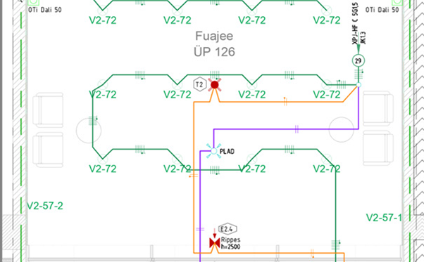

# 4.7 Valgustuse toiteplaanid

Vastavalt [EVS 932:2017](https://www.evs.ee/et/evs-932-2017) ptk 9.15 on valguspaigaldise osa projekteerimine käsitletud eraldi projekti osana (VA), mida koostab valgustuse projekteerija. Käesolev peatükk käsitleb **elektriprojekteerija vastutusalasse** kuuluvaid valgustuse elektripaigaldise osi — toiteahelad, kaabeldus, kaitseaparatuur ja juhtimissüsteemide sidumine elektrikilpidega.

Elektriprojekteerija ja valgustuse projekteerija tööjaotus on käsitletud peatükis [2.3.3 Koostöö valgustuse osa projekteerijaga](../2_Projekteerimine/2.3_Koostöö_Teiste_Osapooltega.md#233-koostoo-valgustuse-osa-projekteerijaga).

## 4.7.1 Sisu nõuded staadiumite kaupa

**Üldvormistus:** Järgida [ptk 3.4](../3_Dokument/3.4_Jooniste_Vormistamise_Nõuded.md) nõudeid.

**EP (Eelprojekti staadium):**

* Eraldi valgustuse plaane ei esitata. Valgustuse elektritarbimisest tulenevad võimsused arvestatakse hoone võimsusbilansis (vt [4.10 Arvutused](4.10_Arvutused.md)).
* Kontseptuaalselt määratletakse valgustuse juhtimispõhimõte (nt DALI, KNX, lokaalne) ning hädavalgustuse süsteemi tüüp (autonoomsed valgustid või kesktoitega süsteem) — sisendiks valgustuse projekteerijale.

**PP (Põhiprojekti staadium):**

* Elektriprojekteerija eraldi valgustuse plaane ei koosta — valgustite paiknemise plaanid esitab valgustuse projekteerija (VA).
* Valgustuse toitegrupid kajastatakse kilbiskeemides koos kaitseaparatuuriga.

**TP (Tööprojekti staadium):**

* **Kaabeldus valgustuse projekteerija plaanidel:**
    * Toitekaablite kulgemine valgustite vahel ja jaotuskeskusest valgustusgrupi esimese valgustini.
    * Kaablite margid (mark, sooned, ristlõige) iga ahela kohta.
    * Toitegruppide numbrid ja viited toite jaotuskeskusele (nt JK1-G15).
    * Erinevate toitesüsteemide (TAVA / GEN / UPS) ahelate eristamine kihtide või värvidega.
* **Hädavalgustuse / evakuatsioonivalgustuse kaabeldus** näidatakse eraldi (sh tulepüsivate kaablite ja monitooringu ühenduste tähistamine).
* **Juhtimissüsteemi kaabeldus:**
    * DALI / KNX magistraal ja kontrollerite ühendused.
    * Andurite (kohaolu-, liikumis-, valgus-, hämarandurid), lülitite, hämardite ja juhtpaneelide kaabeldus.

*Märkus: TP staadiumis PP staadiumi lahendusi enam ei muudeta. Kui TP koostamise käigus ilmneb vajadus PP lahenduste muutmiseks, tuleb see teostada eraldi tööna PP staadiumi muudatusena.*

<figure markdown="span">
  
  <figcaption>Joonis 1. Näide valgustuse plaanist peale tugevvooluosa kaabelduse lisamist</figcaption>
</figure>

<figure markdown="span">
  
  <figcaption>Joonis 2. Elektriprojekteerija väljund TP staadiumis — kaabeldus lisatud valgustuse projekteerija plaanile</figcaption>
</figure>
