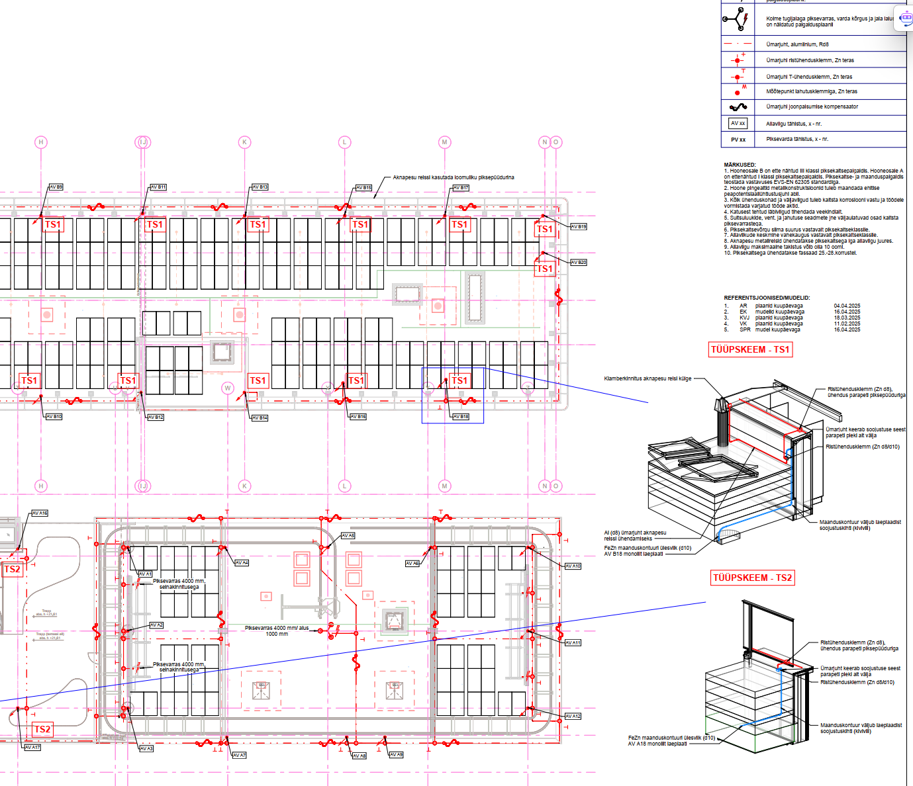

# 4.9 Maandus ja piksekaitse

Piksekaitse-, maandus- ja potentsiaaliühtlustussüsteemid on hoone ohutuse ja elektriseadmete nõuetekohase toimimise seisukohalt kriitilise tähtsusega. Nende süsteemide korrektne projekteerimine ja dokumenteerimine plaanidel tagab kaitse pikselöökide, ohtlike puutepingete ja elektromagnetiliste häirete eest.

Üldnõuded maandus- ja piksekaitsesüsteemidele on käsitletud peatükis [4.2 Üldnõuded ja standardid](4.2_Yldnouded_ja_standardid.md).

## 4.9.1 Piksekaitse süsteemi plaanid

Piksekaitse süsteemi projekteerimine algab riskihindamisega vastavalt [EVS-EN 62305-2](https://www.evs.ee/et/evs-en-62305-2-2013) standardile, et määrata kindlaks vajalik piksekaitseklass.

Piksekaitse süsteem esitatakse üldjuhul katuseplaanil, vajadusel ka korruseplaanidel (eriti varjatud allaviikude puhul). Tüüpkorruste puhul piisab ühest tüüpplaanist; mõõtkava võib olla 1:200.

**EP (Eelprojekti staadium):**

* Piksekaitse vajalikkuse hinnang ja valitud piksekaitseklass.
* Kontseptuaalne lahendus: püüdurite, allaviikude ja maanduse põhimõtteline paiknemine.

**PP (Põhiprojekti staadium):**

* **Katuseplaan:**
    * Kõik katusel asuvad olulisemad elemendid (ventilatsiooniseadmed, PV-paneelid, fassaadipesusüsteemid, reklaamid jms).
    * Piksepüüdurivõrgu ja/või -varraste paigutus, tüüp ja materjal.
    * Ühendused katuse metallkonstruktsioonidega, mida kasutatakse loomuliku piksekaitse osana (nt metallkatus, fassaadipesu relsid).
    * Allaviikude ühenduskohtade asukohad katusel.
    * Vajadusel lisapotentsiaaliühtlustuslatid katusel.
* **Korruste plaan(id) (vajadusel):**
    * Postide või konstruktsioonide tähistamine, kus asuvad piksekaitse allaviigud, eriti kui need on varjatud.
* Materjalide esmane tüüpide valik, ühendused maandussüsteemiga ja loomulike komponentidega.
* Ülesanne konstruktorile konstruktsioonisiseste allaviikude osas.

**TP (Tööprojekti staadium):**

* Kogu PP info täpsustatuna, kõikide komponentide täpsed asukohad ja valik.
* Sõlmejoonised oluliste liitekohtade ja erilahenduste kohta.
* Komponentide täpne valik ja paigaldusdetailid.

<figure markdown="span">
  
  <figcaption>Joonis 1. Näide piksekaitse süsteemi plaanist</figcaption>
</figure>

## 4.9.2 Maanduspaigaldise plaan

Maanduspaigaldise eesmärk on tagada ohutu potentsiaaliühtlustus ja rikkevoolude juhtimine maasse. Alusplaanina kasutatakse vundamendi plaani koos seintepaigutusega.

**EP (Eelprojekti staadium):**

* Maanduspaigaldise kontseptsioon (nt vundamendimaanduri eelistus).
* Peamaanduslati (PML) ligikaudne asukoht.

**PP (Põhiprojekti staadium):**

* Horisontaalse maanduri (nt ümarteras, lintteras, vundamendisarrus) kulgemistee, materjal ja mõõdud.
* Vertikaalsete maanduselektroodide asukohad, sügavused ja tüübid (kui kasutatakse).
* Peamaanduslati (PML) täpne asukoht ja selle ühendamine maanduriga.
* Piksekaitse maandussüsteemi allaviikude ühenduskohad maanduspaigaldisega koos kontrollühenduskohtadega (testklemmide asukohad).
* Konstruktsioonidesse paigaldatavate piksekaitse allaviikude põhimõtteline lahendus ja ülesanne konstruktorile.

**TP (Tööprojekti staadium):**

* Kogu PP info täpsustatuna.
* Ühendussõlmede joonised (nt maandusjuhtide ühendused sarrustega, seadmetega, PML-iga).
* Kontrollkaevude ja -klemmide täpsed asukohad.
* Nõuded maandustakistusele (nt piksekaitse maanduse puhul) ja selle mõõtmisele.

## 4.9.3 Potentsiaaliühtlustuse projekteerimine

Potentsiaaliühtlustus tagab, et kõik samaaegselt puudutatavad juhtivad osad on samal potentsiaalil, vähendades elektrilöögi ohtu.

**EP (Eelprojekti staadium):**

* Potentsiaaliühtlustuse vajaduse ja põhimõtete (peamine, täiendav) kirjeldus seletuskirjas.

**PP (Põhiprojekti staadium):**

* Peamaanduslati (PML) asukoht/asukohad.
* Täiendava potentsiaaliühtlustuse vajadusega piirkondade (nt vannitoad, eriruumid) määratlemine ja lahenduspõhimõtted.
* Lisapotentsiaaliühtlustuslattide asukohad ja nendega ühendatavad osad.

**TP (Tööprojekti staadium):**

* Potentsiaaliühtlustuselementide (latid, klemmid) täpsed asukohad ja paigaldusdetailid.

## 4.9.4 Markeerimine, tähistus ja sõlmed plaanidel

* Kõik piksekaitse-, maandus- ja potentsiaaliühtlustussüsteemi komponendid peavad olema plaanidel selgelt tähistatud vastavalt kehtivatele standarditele ja projekti tingmärkide legendile.
* **PP staadiumis** näidatakse olulisemad sõlmed põhimõtteliselt.
* **TP staadiumis** esitatakse vajalikud detailsed sõlmejoonised, mis selgitavad komponentide omavahelisi ühendusi, paigaldusnõudeid, erilahenduste ja oluliste liitekohtade puhul, mida toote paigaldusjuhendites pole toodud.

## 4.9.5 Seotud loetelud ja dokumendid

* **Materjalide spetsifikatsioonid:** Piksekaitse-, maandus- ja potentsiaaliühtlustussüsteemide komponentide (vardad, juhid, klemmid, latid, liigpingepiirikud jne) spetsifikatsioonid esitatakse vastavalt juhendi ptk 3.6 nõuetele.
* **Ülesanded teistele osapooltele:** Näiteks ülesanne konstruktorile piksekaitse allaviikude integreerimiseks hoone konstruktsioonidesse.
