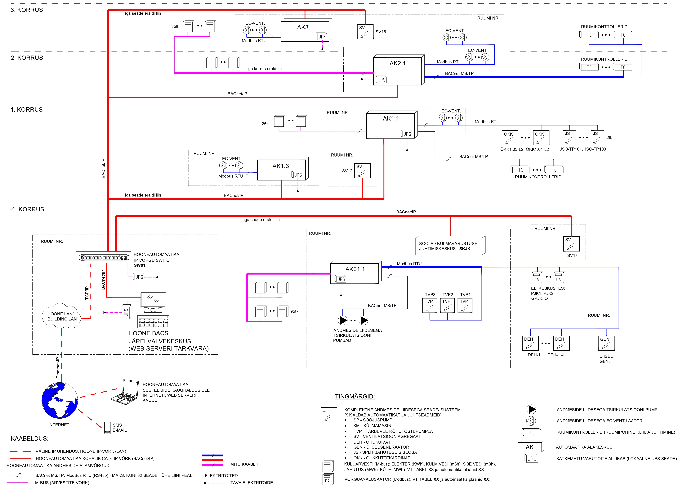
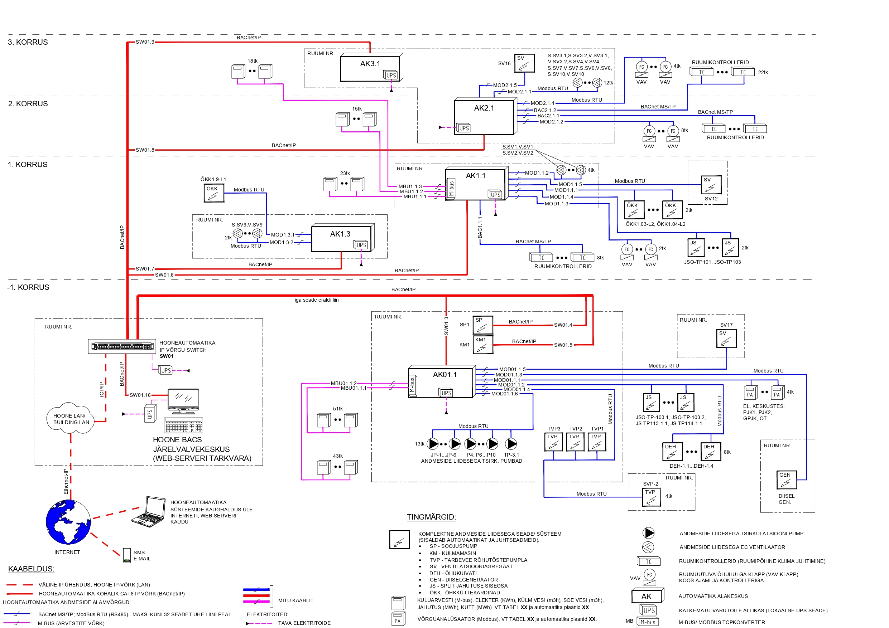

# 6.4 Struktuur- ja funktsionaalskeemid

#### 6.4.1. Hooneautomaatika struktuurskeem

Struktuurskeem annab graafilise ülevaate hooneautomaatika süsteemi arhitektuurist, peamistest seadmetest (alakeskused, serverid, võrguseadmed) ja nendevahelistest andmesideühendustest.

* **EP (Eelprojekti Staadium):**
    * Struktuur- ega funktsionaalskeemide koostamine ei ole kohustuslik. Automaatikasüsteemi vajadused, üldised funktsioonid ja süsteemide ulatus kirjeldatakse seletuskirjas .
    * Kui koostatakse (märgitud tabelis *1 kui EP-s alakeskuse täpsusega), siis näidatakse alakeskuste põhimõttelised asukohad (ruumi nr/kirjeldus, korrus) ja nendega seotud põhisüsteemid (loeteluna) .
    * Andmesidevõrkude põhimõttelised ühendused (alakeskuste vaheline põhivõrk, tehnoserver, välisühendus) .
    * Automaatikakeskuste paiknemine ja ruumivajadus võib olla esitatud BIM mudelis .
* **PP (Põhiprojekti Staadium):**
    * Näidatakse alakeskused ruumi täpsusega .
    * Andmeside põhivõrkude ühenduspõhimõte, sh: alakeskuste vaheline side (CAT, optika, juhtmevabad ühendused), tehnoserveri asukoht ja ühendus põhivõrguga, välisühendus (nt kaugjuhtimiseks, hoolduseks) .
    * IP võrgujaotlate (rackide) asukohad ja kasutusloogika: kas automaatikaseadmed paigutatakse NV jaotlasse või vajatakse eraldi automaatikaracki. Märkida ruum ja üldine põhimõte .
    * Struktuurskeemil tuleb näidata alakeskustega seotud võrgupõhised liidestused ehk süsteemid või seadmed, millega toimub kommunikatsioon võrguliidese (nt BACnet, Modbus, M-bus, KNX) kaudu (nt komplektsed ventilatsiooniagregaadid, ruumikontrollerid, energiaarvestid) .
    * Näidatakse automaatika keskuste ja võrguseadmete toitevajaduste põhimõte (tavatoide, garanteeritud toide, katkematu toide) .

<figure markdown="span">
  
  <figcaption>Joonis 6.4.1. Hooneautomaatika struktuurskeemi näidis põhiprojekti staadiumis</figcaption>
</figure>
* **TP (Tööprojekti Staadium):**
    * Tööprojekti struktuurskeem täpsustab põhiprojekti skeemis määratud ülesehitust, lisades seadmetepõhise ja teostuseks vajaliku detailtaseme .
    * Täpsustatakse:
    * Andmeside põhivõrgu tegelikud ühendused ja kaablitüübid (nt CAT7, optika, Wi-Fi), vajadusel kaabli trajektoor ja pikkus .
    * Võrguseadmete täpsed asukohad (ruumi täpsusega) ja tüübid (switchid, konverterid), koos tähiste ja sidumistega .
    * IP-võrgujaotlate täpsustatud asukohad ja tähised .
    * Andmeside kaudu alakeskustega seotud seadmed ja süsteemid täpsustatakse seadmetasemel: liidese tüüp, liinide arv ja jaotus, algus- ja lõpp-punktid, vajadusel liini pikkus, liiniga seotud seadmete kogus ja vajadusel aadressivahemikud, sidekaabli tüüp, lõputakistite asukohad RS485 põhiste liinide puhul (Modbus RTU, BACnet MS/TP) .
    * Kaabeldus seadmest seadmeni täpsusega (võib esitada kaablitabelina) .

<figure markdown="span">
  
  <figcaption>Joonis 6.4.2. Hooneautomaatika struktuurskeemi näidis tööprojekti staadiumis</figcaption>
</figure>

#### 6.4.2. Arvestite struktuuriskeem

Arvestite struktuurskeem kirjeldab, kuidas toimub erinevate energiakandjate (vesi, elekter, soojus, gaas) ja muude ressursside mõõtmine ning andmete kogumine.

* **EP (Eelprojekti Staadium):**
    * Eelprojekti staadiumis ei ole arvestite struktuur- ega funktsionaalskeemid nõutud. Vajalik info (sh energialiigid ja arvestuspõhimõtted) esitatakse seletuskirjas (vt ka ptk 6.2).
* **PP (Põhiprojekti Staadium):**
    * Põhiprojektis tuleb arvestite andmeedastuse ülesehitus esitada struktuurskeemina. Skeem võib olla eraldi või integreeritud hooneautomaatika struktuurskeemi, kui skeem jääb selgeks .
    * Näidatakse struktuurskeemil :
    * Arvestite jagunemine korruste kaupa.
    * Millise alakeskuse või master-seadmega on arvestid seotud (master-seadme asukoht ruumi täpsusega).
    * Andmeedastuse põhimõte (juhtmega, juhtmevaba, andmeedastusprotokoll, kaabelduse põhimõte).
    * Andmeedastuskonverterid (nt M-bus, Modbus), mitu arvestit ühendatud iga konverteri taha.
    * *Märkus: Skeemil tuleks viidata arvestite tabelile, mis sisaldab arvestite tähiseid, liiki ja paiknemist. Tabel täpsustab skeemi* .
    * (Siia mingi näidisstruktuurskeem - joonis xxx) .
* **TP (Tööprojekti Staadium):**
    * Tööprojektis täpsustatakse põhiprojektis esitatud arvestite struktuuri vastavalt valitud lahendusele ja tegelikele seadmetele . Skeem võib olla eraldi või hooneautomaatika struktuurskeemi osa .
    * Skeemil esitatakse :
    * Arvestite jagunemine korruste ja energialiikide kaupa, koos arvestite kogusega liini kohta.
    * Andmeedastuse tüüp ja protokoll (nt M-bus, Modbus, LoRa, RS485 jne).
    * Konverterite asukohad, iga liini arvestite arv, hargnemispunktid ja sideühendused.
    * *Märkus: Skeemil viidata arvestite tabelile, mis sisaldab kõikide süsteemi liidetud arvestite detailid (igal arvestil unikaalne tähis, arvesti asukoht, teeninduspiirkond, andmeside liidese tüüp, elektriarvestitel keskus, kus arvesti asub ning lisaks keskuse asukoht). Tabel täiendab skeemi* .
    * (Siia mingi näidisstruktuurskeem - joonis xxx) .

#### 6.4.3 Tehnosüsteemide (KVJ) funktsionaalskeemid

Funktsionaalskeemid (EVS kohaselt tehnosüsteemide toimimisskeemid ) kirjeldavad detailselt, kuidas konkreetne tehnosüsteem (küte, ventilatsioon, jahutus - KVJ) automaatikasüsteemi poolt juhitakse ja reguleeritakse.

* **EP (Eelprojekti Staadium):**
    * Üldised põhimõtted esitatakse seletuskirjas (vt ptk 6.2) .
* **PP (Põhiprojekti Staadium):**
    * Esitatakse funktsionaalskeem koos mõõte- ja juhtimisseadmetega (andurid, täiturid) .
    * Näidatakse iga mõõte- ja juhtimisseadme IO punktid (füüsilised ja virtuaalsed) .
    * Näidatakse iga mõõte- ja juhtimisseadme ühendused (alakeskuste ja seadmete vahel, seadmete ja elektrikilpide vahel, seosed elektrikilpide ja alakeskuse vahel jms) .
    * Esitatakse skeemi tööpõhimõtte kirjeldus .
    * Esitatakse mõõte- ja reguleerimispunktide põhiparameetrid (vt ptk 6.6 tabelis 1 minimaalselt IO punktide osa, seadesuuruste osa soovituslik) .
    * Lisada näiteid skeemi ja parameetrite tabeli kohta (joonis xxx, Tabel 1 näidis ).
    * **Tehaseautomaatikaga seadme korral:** 
    * Lisada eriosa projekteerijalt saadud tehnoloogiline skeem koos mõõte- ja juhtimisseadmetega.
    * Näidata hooneautomaatikaga seotud füüsilised punktid (nt tööluba, olek, üldhäire vms).
    * Näidata seadme andmeside liidese kaudu sidumise põhimõte ja minimaalne/eeldatav IO maht (punktide arv) ning põhiline vahetatav info .
    * Kirjeldada funktsioone, mida hooneautomaatika peab täitma väljaspool seadme enda tehaseprogrammi .
    * (Tekitada mingi tabel näidisena, vastavalt [ÜBN](https://eehitus.ee/juhendid/bim/) nõuetele - joonis xxx).
* **TP (Tööprojekti Staadium):**
    * Täpsustatakse PP funktsionaalskeemid vastavalt valitud seadmetele ja tehnoloogiatele . PP-s esitatud punktid ja tööpõhimõtted jäävad kehtima, kui neid ei muudeta .
    * **Skeemidel täpsustada:**
    * Reaalselt tarnitavad andurid ja täiturid (tootja/tüüp kui teada, vajadusel standardlahenduse alusel) .
    * IO-punktid ja nende liigid vastavalt kasutatavale kontrollerile (füüsilised/virtuaalsed, sisendid/väljundid/reguleerimissignaalid) .
    * Seadmete ühendused kaabliühenduste täpsusega, koos tähiste ja paigalduskohtadega (võib viidata kaablite loetelule) .
    * Vajadusel täiendavad toiteühendused, kui need ei tule automaatikakeskusest .
    * Täpsustada tööloogika, kui see erineb PP skeemis esitatust .
    * **Mõõte- ja reguleerimispunktide tabel:**
    * Täita tabel 1 (vt ptk 6.6) kõik väljad täpsustatud andmetega (v.a programmide osa, mis võib olla teostusprojekti osa) .
    * **Tehaseautomaatikaga seadme korral:** 
    * Kinnitada ja lisada tootja/tarnija tehnoloogiline skeem.
    * Näidata füüsilised punktid, mille kaudu seade liidestub hooneautomaatikaga.
    * Täpsustada andmeside liidese kaudu liidestumise loogika (protokoll, sidekonverter, sidepunkti asukoht, seadmete aadressid kui teada).
    * Täpsustada info, mida andmeside liidese kaudu seadmega vahetatakse (vastavalt tarnitava seadme Modbus registri/BACnet object list andmetele).
    * Märkida ära, milliseid funktsioone hooneautomaatika peab täitma, kui need on väljaspool seadme enda tehaseprogrammi (nt perioodiline ümberlülitus, energiaarvestus, kliimakõver jms) .

#### 6.4.4. Ruumi kliimajuhtimise funktsionaalskeemid

Need skeemid keskenduvad üksikute ruumide või tsoonide kütte, ventilatsiooni ja jahutuse (KVJ) juhtimisele.

* **EP (Eelprojekti Staadium):**
    * Üldised põhimõtted esitatakse seletuskirjas (vt ptk 6.2) .
* **PP (Põhiprojekti Staadium):**
    * Esitada funktsionaalskeem koos mõõte- ja juhtimisseadmetega (andurid, täiturid) .
    * Näidata iga mõõte- ja juhtimisseadme IO punktid (füüsilised ja virtuaalsed) .
    * Näidata ühendused ruumiseadmete vahel, alakeskuste ja seadmete vahel, seadmete ja elektrikilpide vahel, seosed elektrikilpide ja alakeskuse vahel .
    * Skeemi tööpõhimõtte kirjeldus .
    * Mõõte- ja reguleerimispunktide parameetrid (tööpõhimõtte kirjelduses või eraldi tabelina) .
    * Lisada mitu näidet - vesijahutus (fancoilid, jahutuspalgid), freoonjahutus (splitid, VRV) (joonis xxx).
* **TP (Tööprojekti Staadium):**
    * Täpsustatakse PP skeemid vastavalt valitud seadmetele, ühendustele ja parameetritele .
    * Skeemil näidata valitud või projekteeritud andurid ja täiturid (nt konkreetse tooteseeria kontrollerid, ventiiliajamid, ruumitermostaadid jne) .
    * Täpsustada IO punktid vastavalt kasutatavale kontrollerile (füüsilised/virtuaalsed, signaalitüübid - 0–10 V, digitaalne jne) .
    * Täpsustada seadmetevahelised ühendused vastavalt konkreetsetele toodetele, sh toiteühendused, protokollipõhised liidesed (nt BACnet MS/TP, Modbus RTU), sidevõrkude liitumine .
    * Täpsustada tööloogika kirjeldus, kui see erineb PP-s esitatust .
    * Täpsustada mõõte- ja reguleerimispunktide parameetrid (tööpõhimõtte kirjelduses või eraldi tabelina) .
    * (Lisada mitu näidet - vesijahutus (fancoilid, jahutuspalgid), freoonjahutus (splitid, VRV) - joonis xxx).

#### 6.4.5. Valgustuse juhtimise funktsionaalskeemid

Kirjeldavad valgustussüsteemide automaatse juhtimise lahendusi (nt DALI, KNX).

* **EP (Eelprojekti Staadium):**
    * Üldised põhimõtted esitatakse seletuskirjas (vt ptk 6.2) .
* **PP (Põhiprojekti Staadium):**
    * Funktsionaalskeem koos mõõte- ja juhtimisseadmetega (andurid, lülituselemendid, täiturid) .
    * Iga mõõte- ja juhtimisseadme IO punktid (füüsilised ja virtuaalsed) .
    * Ühendused ruumiseadmete, alakeskuste, seadmete ja elektrikilpide vahel .
    * Skeemi tööpõhimõtte kirjeldus .
    * Mõõte- ja reguleerimispunktide põhiparameetrid (nt tabelis 1, vt ptk 6.6 , IO punktide osa, seadesuuruste osa soovituslik) .
    * Andmeside võrgupõhiste valgustuse juhtimise lahenduste (KNX, DALI vms) sidumise korral esitada lisaks: andmeside liidese kaudu sidumise põhimõte ja sidumise eeldatav IO maht (visualiseeritavate punktide juhtimise ja jälgimise maht) .
    * Lisada mitu näidet - tava valgustuse kohta ja DALI näiteks (joonis xxx).
* **TP (Tööprojekti Staadium):**
    * Põhiprojektis esitatud üldised põhimõtted jäävad kehtima. Tööprojektis täpsustatakse PP skeemid vastavalt valitud lahendusele ja seadmetele .
    * Täpsustada :
    * Andurite, lülituselementide ja täiturite valitud tüübid ja ühendused vastavalt tarnitavale lahendusele (sh tootja kui teada).
    * IO-punktide täpsustus vastavalt kasutatavale kontrollerile (füüsilised/virtuaalsed, signaalitüüp) .
    * Ühenduste kaablid ja skeemid koos füüsiliste ühenduspunktide ja kaablitähistega .
    * Täpsustatud tööpõhimõtte kirjeldus, kui see erineb või täieneb võrreldes PP-ga .
    * Täpsustada mõõte- ja reguleerimispunktide parameetrid (tabeli 1 väljad, v.a programmide osa, mis võib olla teostusprojekti osa) .
    * Andmeside võrgupõhiste valgustuse juhtimise lahenduste sidumise korral esitada lisaks :
    * Andmeside liidese kaudu sidumise põhimõte (KNX, DALI vms).
    * Sidumise IO maht (visualiseeritavate punktide juhtimise ja jälgimise maht koos kirjeldusega).
    * (Näide? - joonis xxx).

#### 6.4.6 Eripunktide skeem (üldised IO punktid)

Eripunktide alla kuuluvad kõik juhtimis-, jälgimis- ja häirepunktid, mis ei kajastu tehnoloogiaga seotud funktsionaalskeemidel, kuid mis toetavad hoone tehnosüsteemide energiatõhusat, säästlikku ja ohutut toimimist .

* **Näited eripunktidest** : Tuletõkkeklappide asendiinfo; põhi- ja varuelektrivarustuse oleku/häire info; sadevee- ja reoveepumplad; tuletõrjeliftide pumplad; tarbevee rõhutõstepumplad; õli-, muda- ja liivapüüdurid; lifti keskuste häired; väliala elektrikütted; välisvalgustus; sisevalgustus (üldalad); külmakompressori ruumide gaasilekke andurid; hooneosade pea vee- ja gaasisulgurid ning gaasilekke häired. Eripunktide maht sõltub hoone iseloomust .
* **EP (Eelprojekti Staadium):**
    * Üldised põhimõtted kirjeldatakse seletuskirjas (vt ptk 6.2) .
* **PP (Põhiprojekti Staadium):**
    * Funktsionaalskeem koos mõõte- ja juhtimisseadmetega (andurid, lülituselemendid, täiturid) .
    * Iga mõõte- ja juhtimisseadme IO punktid (füüsilised ja virtuaalsed) .
    * Ühendused ruumiseadmete vahel, alakeskuste ja seadmete vahel, seadmete ja elektrikilpide vahel, seosed elektrikilpide ja alakeskuse vahel .
    * Skeemi tööpõhimõtte kirjeldus .
    * Mõõte- ja reguleerimispunktide põhiparameetrid (nt tabelis 1, vt ptk 6.6 , IO punktide osa, seadesuuruste osa soovituslik) .
    * **Tehaseautomaatikaga seadme korral:** Näidata hooneautomaatikaga seotud füüsilised punktid (nt tööluba, olek, üldhäire), andmeside liidese kaudu sidumise põhimõte ja IO maht .
    * (Näidisskeem - joonis xxx).
* **TP (Tööprojekti Staadium):**
    * Esitada täpsustatud ja lõplikud andmed vastavalt tarnitavale tehnoloogiale .
    * Funktsionaalskeem koos mõõte- ja juhtimisseadmetega (andurid, lülituselemendid, täiturid) .
    * Iga mõõte- ja juhtimisseadme IO punktid (füüsilised ja virtuaalsed) .
    * Iga mõõte- ja juhtimisseadme ühendused .
    * Skeemi tööpõhimõtte kirjeldus .
    * Mõõte- ja reguleerimispunktide parameetrid (tabeli 1 väljad, v.a programmide osa) .
    * **Andmeside võrgupõhiste lahenduste korral:** Näidata hooneautomaatikaga seotud füüsilised punktid, andmeside liidese kaudu sidumise põhimõte ja IO maht .
    * (Näidisskeem - joonis xxx).