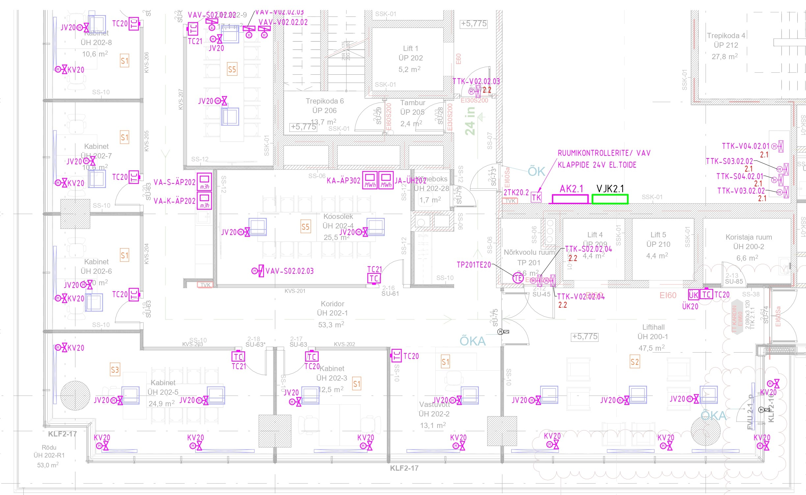
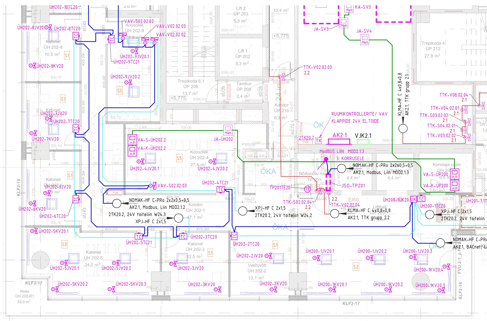

# 6.5 Tasapinnaplaanid

Tasapinnaplaanidel näidatakse automaatikasüsteemi komponentide (alakeskused, andurid, täiturid, ruumikontrollerid jms) füüsilised asukohad hoone korrusteplaanidel.

**EP (Eelprojekti staadium):**

* Automaatikapaigaldise tasapinna plaane üldjuhul ei esitata . Peamiste automaatikakilpide (alakeskuste) ja tehnoserveri ruumi(de) põhimõttelised asukohad kirjeldatakse seletuskirjas (vt ptk 6.2) .

**PP (Põhiprojekti staadium):**

* Esitatakse korruste plaanid, millel on näidatud kõik seadmed ja süsteemid, mis liidestuvad hooneautomaatikaga (BMS) .
* Plaanidel näidatakse :
* Hooneautomaatika alakeskused ja nende tähised.
* Ruumikontrollerid.
* Ruumikontrolleritega seotud ventiilid (küte, jahutus, põrandaküte).
* Arvestid (vesi, soojus, elekter, gaas); elektriarvestite puhul võib olla viidatud vastavale elektrikilbile .
* Ruumiandurid (temperatuur, CO₂, niiskus, kohalolek, valgus jms).
* Tehnoseadmed, mis liidestuvad BMS-iga (ventilatsiooniseadmed, kütte-/jahutusseadmed, VAV-klapid, on/off klapid, tuletõkkeklapid jne).
* Elektri- ja nõrkvoolukilbid, mis on seotud hooneautomaatikaga.
* Toiteallikad, trafod, ühenduskarbid (kui funktsionaalses skeemis määratletud).
* Soovituslikult näidata alakeskuste eeldatavad teeninduspiirkonnad visuaalselt ning märkida seadmete tähised ja ruumiandurid vastavalt funktsionaalskeemile .
* **Seadmete tähistus:** PP-s ei ole nõutav iga seadme unikaalne tähis; tüüpseadmed võivad olla tähistatud tüüptähistega (nt KV20, TC20). Tähistus peab võimaldama üheselt tuvastada sama seadet kõigis projektiosades .

<figure markdown="span">
  
  <figcaption>Joonis 1. Automaatikapaigaldise plaani fragment — põhiprojekti staadium</figcaption>
</figure>

**TP (Tööprojekti staadium):**

* Täpsustatakse PP plaanidel näidatud seadmete ja süsteemide asukohad, paigalduskõrgused ja ühenduspunktid vastavalt valitud seadmetele ja tööjoonistele .
* Plaanidel täpsustada :
* Kõikide seadmete ja andurite täpsustatud asukohad.
* Paigalduskõrgused anduritel ja kontrolleritel.
* Ühenduspunktide info (ühenduskarbid, liinisisendid jms).
* Seadmete kaabeldus, näidates seadmetevahelise kaabelduse, liini alguspunkti ja kaabli tüübi/margi. Ruumipõhise kliimajuhtimise puhul ei ole seadmetevahelise kaabelduse detailne esitamine plaanidel üldjuhul vajalik — kaabelduse põhimõte esitatakse tüüpsel skeemil ning detailne info ruumide kaupa kaablitabelis. Samas tuleb plaanidel esitada andmeside- ja ruumikontrollerite toitekaabeldus.
* Märkused/täiendav info eritingimusi vajavatele seadmetele.
* **Seadmete tähistus:** Kõik seadmed peavad olema unikaalse tähisega, mis seob seadme vastava süsteemiga (nt ruumikliima seadmetel ruuminumbriga). Ruumipõhiste seadmete tähistus: ruuminumber + seadme tüübikood + järjekorranumber (nt 234TC20.1). Tähistus peab olema järjepidev.

<figure markdown="span">
  
  <figcaption>Joonis 2. Automaatikapaigaldise plaani fragment — tööprojekti staadium</figcaption>
</figure>