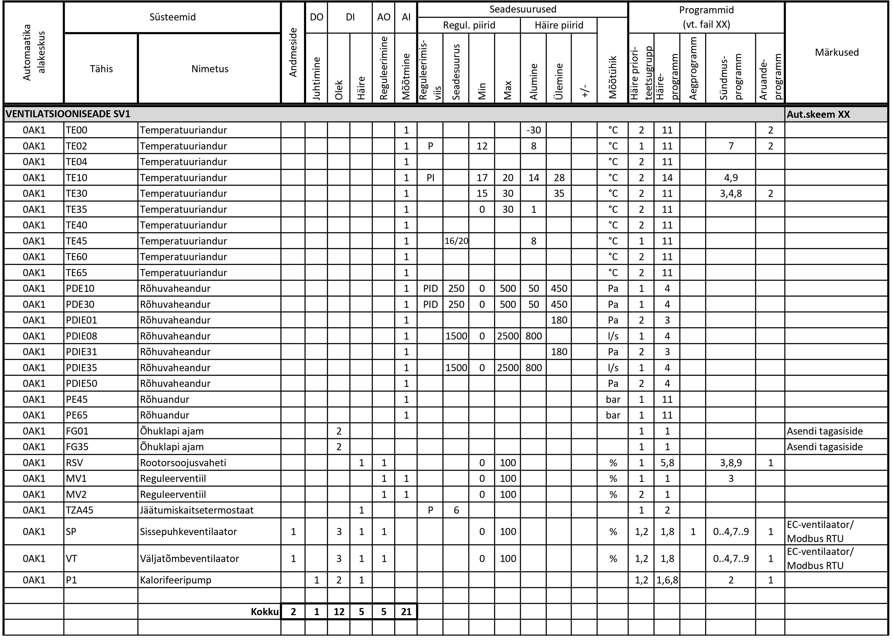

# 6.6 Loetelud

## I/O punktide loetelu

I/O (Input/Output) punktide loetelu on detailne tabel, mis koondab kõik automaatikasüsteemi sisend- ja väljundsignaalid.

* **EP (Eelprojekti Staadium):**
    * Üldjuhul I/O punktide loetelu ei esitata. Üldised põhimõtted kirjeldatakse seletuskirjas (vt ptk 6.2) .
* **PP (Põhiprojekti Staadium):**
    * Esitatakse I/O-punktide tabel, mis põhineb funktsionaalskeemidel ja määratleb süsteemide mõõte- ja juhtimispunktid . See on funktsionaalne töövahend sidumaks plaanidel ja skeemidel näidatud seadmeid, programmeeritavaid punkte ja visualiseeritavat infot .
    * Tabeli formaadis esitada :
    * Kõik füüsilised I/O-punktid: DO, DI, AO, AI (vähemalt punktide tüüp, tähis, nimetus/funktsioon, punktide kogus).
    * I/O punkti tähis peab vastama skeemile ja plaanile .
    * Juhitavate/reguleeritavate punktide korral märkida reguleerimisviis (nt on/off, PI, PID) mõõtepunktil või vajadusel ka juhtimis-/reguleerimispunktile .
    * Andmesidega liidestuvad seadmed: liidestatavate seadmete/süsteemide kogus ja liidese tüüp. Üks seade/süsteem on üks andmepunkt (mitte kõik sisemised muutujad).
    * Programmid — millise häire-, oleku- või juhtimisprogrammi alla punkt kuulub (viide programmide loetelule). Programmide loetelu võib asendada funktsionaalskeemide ja nende tööpõhimõtte kirjeldustega, kui programmide loogika, seosed ja parameetrid on esitatud piisava detailsusega (vt ptk 6.6.6).
    * Alakeskuste kaupa I/O punktid kokku .
    * Soovituslik: Täita seadesuuruse veerud teadaolevate või eeldatavate väärtustega .

<figure markdown="span">
  
  <figcaption>Joonis 1. I/O-punktide ja parameetrite tabeli näidis</figcaption>
</figure>
* **TP (Tööprojekti Staadium):**
    * Täidetakse I/O-punktide tabel vastavalt PP struktuurile, täiendades seda täpsema infoga süsteemi seadistuseks, programmeerimiseks ja visualiseerimiseks .
    * Täpsustada kõik mõõte- ja reguleerpunktid vastavalt tarnitavate seadmete andmetele (sisendid, väljundid, reguleerimisviis jt parameetrid) .
    * Täpsustada mõõte- ja reguleerimispunktide seadesuurused ning häirepiirid ulatuses, mis on projekteerimisstaadiumis määratletav. Vajadusel võib osa parameetreid täpsustuda hilisemates etappides või seadistamise käigus.

#### 6.6.2. Arvestite loetelu

Arvestite loetelu annab süsteemse ülevaate kõikidest automaatikasüsteemiga liidestatavatest mõõteseadmetest.

* **EP (Eelprojekti Staadium):**
    * Üldised põhimõtted kirjeldatakse seletuskirjas, arvestite loetelu ei esitata (vt ptk 6.2) .
* **PP (Põhiprojekti Staadium):**
    * Esitatakse kõigi BMS-iga liidestatavate arvestite ja võrguanalüsaatorite loetelu .
    * Loetelu sisaldab vähemalt :
    * Arvesti unikaalne tähis (ID).
    * Arvesti tüüp (elektri-, sooja-, külma-, vee-, gaasiarvesti või võrguanalüsaator).
    * Teeninduspiirkond (nt korter, jahutussõlm, 1. korruse tiib B jne).
    * Asukoht: korrus ja ruum (nt kilbiruum, tehnoruum, veemõõdusõlm).
    * Elektriarvesti puhul ka elektrikilp, kus see paikneb (nt GPJK, PJK, JK2.1).
    * Andmesideprotokoll (nt M-bus, Modbus, BACnet).
    * Automaatika alakeskus, millega arvesti on seotud.
    * Põhiprojekti tabeli alusel kavandatakse andmeedastuse liidesed ja seadmete asukohad .
    * (Näide - joonis xxx).
* **TP (Tööprojekti Staadium):**
    * Täpsustatakse PP loetelu, lisades infot reaalseks paigalduseks, liidestamiseks ja süsteemi seadistamiseks .
    * Täiendavalt tuleb märkida :
    * Andmeside liin, millega arvesti on ühendatud (nt M-bus liin 1, Modbus liin 1).
    * Konverteri või gateway tähis, millega arvesti liidestub (nt MBCONV1).
    * Arvesti liinisisene aadress (nt M-bus liin 1, aadress 12).
    * Soovituslik: seadme valmistaja ja tüüp, vajadusel aadressivahemikud ja andmetabeli viited .
    * Tööprojekti arvestite loetelu peab võimaldama kaablite arvutusi, aadressi määramist ja liinide jagamist .
    * (Näide - joonis xxx).

#### 6.6.3. Ruumikontrollerite ja ruumiseadmete tabel

See tabel koondab info ruumipõhiste kliimajuhtimise elementide kohta, tagades sidususe funktsionaalskeemide ja paigaldusplaanidega.

* **EP (Eelprojekti Staadium):**
    * Üldised põhimõtted kirjeldatakse seletuskirjas, eraldi loetelu ei esitata (vt ptk 6.2) .
* **PP (Põhiprojekti Staadium):**
    * Tabel ei ole kohustuslik, kuid projektis peab olema üheselt arusaadav, millised erineva konfiguratsiooniga kontrollerid on kasutusel ning milliste ruumiseadmetega on seotud .
    * Kui tabelit ei koostata, tuleb dokumentatsioonis selgelt näidata :
    * Erinevad kontrolleritüübid tähistega (nt TC20, TC21, TC25).
    * Kontrollerite konfiguratsioonid: integreeritud andurid (ruumitemperatuur, CO₂, niiskus), juhtimised (fancoil, jahutuspalk, kütteradiaatorid, VAV jne), juhtimisviisid (on/off, PWM, 0–10V), kasutatav andmesideprotokoll (BACnet, Modbus jt).
    * I/O maht peaks selguma kontrolleriga seotud tüüpselt funktsionaalskeemilt.
    * Seos plaanide, funktsionaalskeemi ja seadmete loeteluga.
    * Sama tähisega kontrollerid (nt kõik TC20) peavad olema funktsionaalselt identsed.
    * (Näide: Ruumikontrollerid näidatud plaanidel + teostatud tüüpne funktsionaalskeem + seadmete loetelus spetsifitseeritud erineva funktsionaalsusega kontrolleri tüübid ja summaarsed kogused ).
* **TP (Tööprojekti Staadium):**
    * Ruumikontrollerite ja ruumiseadmete tabel on kohustuslik .
    * Tabel peab määratlema iga ruumi/tsooni kliimaseadmete ja andurite konfiguratsiooni ning ruumiga seotud kontrolleri konkreetse konfiguratsiooni, I/O mahu, asukoha ja ühendused .
    * Tabel peab sisaldama vähemalt : ruum/tsoon; eri tüüpi ruumikontrollerid; ruumiga seotud andurid; juhtimised (kütteventiilid, jahutusventiilid, VAV klapid jne); paigaldusviis ja lisaseadmed; kontrolleri funktsioon; automaatika alakeskus, millega on seotud; vajadusel I/O punktide jaotus; seos funktsionaalskeemiga; andmeside ja liidese aadress.
    * Kontrolleri ja teiste seadmete unikaalsed tähised peavad olema vastavuses plaanide, I/O tabeli ja skeemidega .
    * (Näide tabelist - joonis xxx).

#### 6.6.4 Põhiseadmete loetelu

Põhiseadmete loetelu annab ülevaate kõikidest hooneautomaatikaga seotud mõõte- ja juhtimisseadmetest, mis ei ole arvestid ega ruumikontrollerid.

* **EP (Eelprojekti Staadium):**
    * Üldised põhimõtted kirjeldatakse seletuskirjas, eraldi loetelu ei esitata (vt ptk 6.2) .
* **PP (Põhiprojekti Staadium):**
    * Esitatakse põhiseadmete loetelu .
    * Iga seadme kohta tuleb näidata : tähis, nimetus, seadme tüüp (lühikirjeldus), tehnilised andmed (mõõtepiirkond, toitepinge, IP-klass, signaalitüüp, kinnitusviis, näidiku olemasolu, ventiilidel Kvs, DN, ajami signaal, tööpinge, avanemiskiirus jms), kogus (samasuguseid võib grupeerida), töövõtu ulatus (kes tarnib/paigaldab), viide skeemile/süsteemile, näidistoode (kui teada) .
    * Kui konkreetne toode pole valitud, piisab üldkirjeldusest .
    * Loetelu peab hõlmama vähemalt automaatika töövõttu kuuluvaid seadmeid . Soovi korral võib lisada ka teistesse töövõttudesse kuuluvaid, automaatikaga seotud seadmeid .
    * Vormistus: funktsionaalskeemide või süsteemide kaupa või tüüpsete seadmete põhiselt, tagades seose teiste projekti osadega .
    * (Näide - joonis xxx).
* **TP (Tööprojekti Staadium):**
    * Loetelu täpsustatakse konkreetse toote tasemele .
    * Lisaks PP infole näidatakse : täpne toode (tootja, tootekood), seadme kirjeldus ja tehnilised andmed vastavalt tarnitavale seadmele, anduri elemendi pikkus, toru DN vms paigalduseks oluline mõõt, keskkonnatingimused, paigaldusviis (kui oluline).
    * TP tabel peab võimaldama seadmed üheselt määratleda, hankida ja paigaldada .
    * (Näide - joonis xxx).

#### 6.6.5 Kaablite loetelu

Kaablite loetelu spetsifitseerib automaatikasüsteemis kasutatavad kaablid, nende tüübid, mahud ja ühendused.

* **EP (Eelprojekti Staadium):**
    * Kaablite loetelu ei koostata. Üldised kaabelduse põhimõtted kirjeldatakse seletuskirjas (vt ptk 6.2) .
* **PP (Põhiprojekti Staadium):**
    * Peab olema üheselt arusaadav, millised seadmed on automaatikaga ühendatud, millise kaablitüübiga, eeldatav kaabelduse maht (koondpikkus tüübi kaupa) ja töövõtupiirid .
    * Vajadusel eritingimused kaablite valikul (tuletundlikkusklass, UV-kindlus jne) .
    * **Esitamisvariandid:** 
    1.  **Kaablite tähistamine skeemidel:** Funktsionaalskeemidele märgitakse kaabli tüüp või tähis koos legendiga. Sobib väiksematele süsteemidele. Puuduseks on muudatuste haldamise keerukus ja halb ülevaade mahtudest . (Näide - joonis xxx) .
    2.  **Eraldi kaablite loetelu tabelina:** Skeemil näidatakse ühendused. Tabelis: tähis, algus- ja lõpp-punkt, kaablitüüp, orienteeruv pikkus (soovituslik), märkus, tuletundlikkuse nõue. Eelis: lihtsam hallata, koondpikkused leitavad . (Näide - joonis xxx) .
    * Soovitus: Koostada kaablite loetelu funktsionaalskeemi või süsteemi põhiselt .
    * Iga kaablitüübi eeldatav koondpikkus peab olema PP-s esitatud . (Näide - joonis xxx) .
* **TP (Tööprojekti Staadium):**
    * Kaablite loetelu koostamine on kohustuslik .
    * Kontrollida ja täpsustada kaablitüübid ja margid vastavalt valitud seadmetele .
    * Lisada/täpsustada kaabli tegelik pikkus (iga kaablilõigu pikkus) .
    * Ruumipõhise kliimajuhtimise kaabeldus võib olla esitatud tüüpskeemide alusel .
    * Kui PP-s oli kaabeldus üldistatud, tuleb TP-s täpsustada iga ühenduse algus ja lõpp (seadme kaupa eraldi või järjestikku ühendades) .
    * Järjestikku ühendatud seadmete puhul määrata, millised seadmed kuuluvad samasse liini, märgistada liini kuuluvus, näidata kaabli alguspunkt ja liini kuuluvad seadmete tähised. Lõplik füüsiline ühendusjärjestus võib kujuneda koostöös töövõtjaga .
    * Lõpliku TP osana tuleb esitada töövõtja poolt täpsustatud kaablitabel, mis sisaldab kõiki TP staadiumis nõutud andmeid .
    * TP tabel peab võimaldama tellida ja paigaldada kõik vajalikud kaablid koos varuga .

#### 6.6.6. Programmide loetelu

Programmide loetelu kirjeldab hooneautomaatika süsteemi tarkvaralisi funktsioone, juhtimisloogikaid ja seadistusi.

* **EP (Eelprojekti Staadium):**
    * Programmide loetelu ei koostata. Üldised põhimõtted kirjeldatakse seletuskirjas (vt ptk 6.2) .
* **PP (Põhiprojekti Staadium):**
    * Esitatakse programmide loetelu, mis kirjeldab põhilisi automaatikasüsteemi funktsioone :
    * Häirete, juhtimise ja reguleerimise loogika alused (nt vastuoluhäired, PI/PID juhtimine).
    * Rakendatavad aeg-, sündmus- ja häireprogrammid.
    * Seadmete töörežiimid ja erifunktsioonid (nt öötuulutus, tööaja loendurid, energiaraportid).
    * Programmide loetelu peab olema siduv I/O punktide tabeliga (viide punkti kuuluvusele programmis) .
    * Loetelu peab võimaldama süsteemi funktsionaalsust hinnata ja olema aluseks hilisemale programmeerimisele .
* **TP (Tööprojekti Staadium):**
    * Täpsustatakse programmide loetelu vastavalt valitud automaatikasüsteemi võimekusele, tellijapoolsetele täpsustustele (nt häireprioriteedid, täpsed piirväärtused, kalendrid) ja tegelikule I/O struktuurile .
    * Võib sisaldada :
    * Täpseid programmeerimisparameetreid (nt filtrihäire viide, temperatuurihüsterees, ajad).
    * Aegprogrammide sisulisi seadeid (nt käivitusajad, suve-/talveaeg).
    * Sündmusloogika jadasid, mille alusel seadmed käituvad.
    