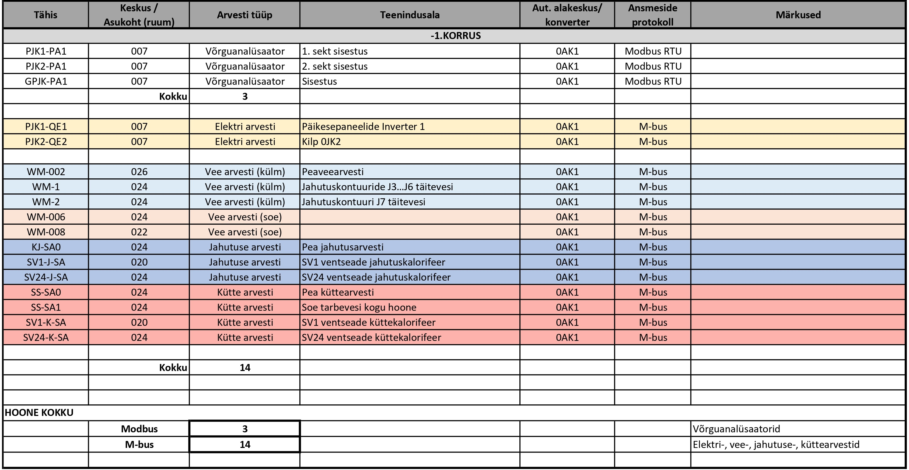
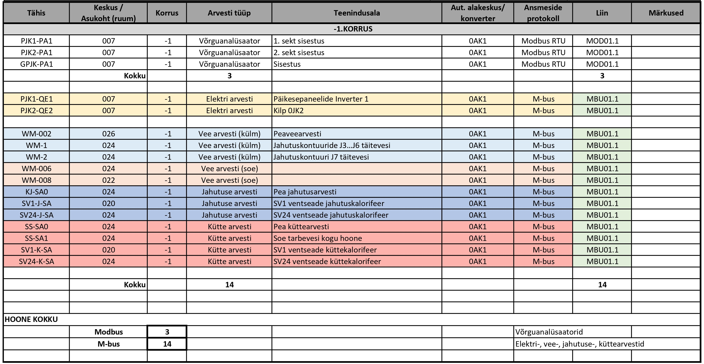
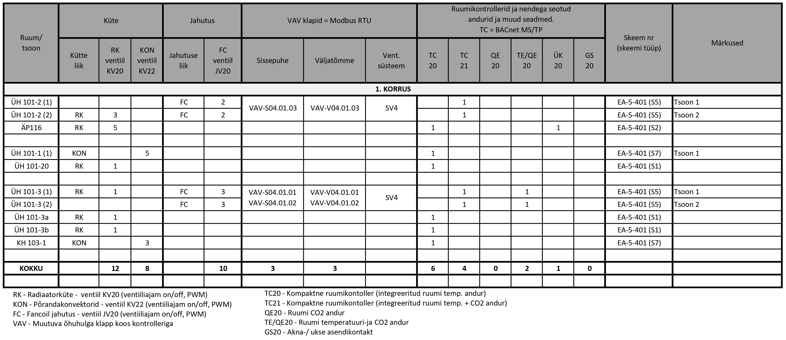
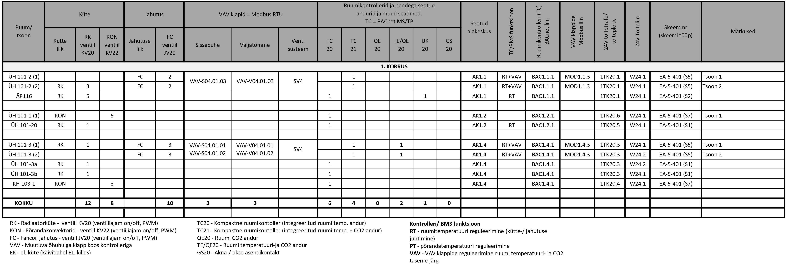
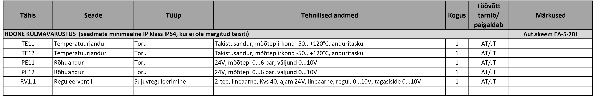
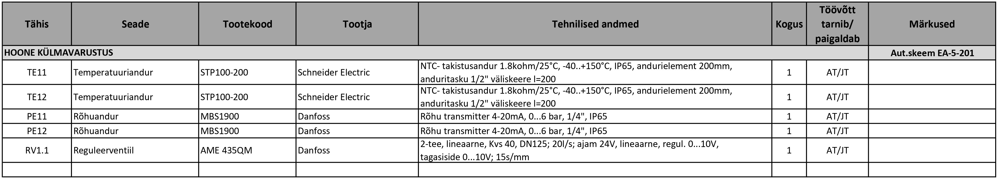
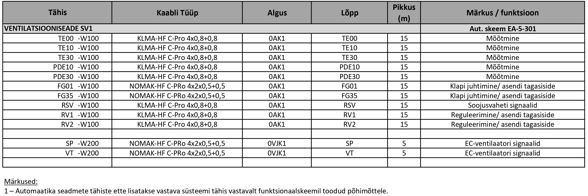
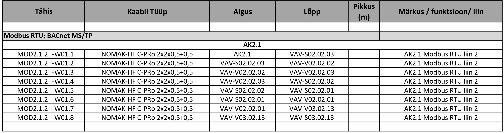

# 6.6 Loetelud

## I/O punktide loetelu

I/O (Input/Output) punktide loetelu on detailne tabel, mis koondab kõik automaatikasüsteemi sisend- ja väljundsignaalid.

* **EP (Eelprojekti Staadium):**
    * Üldjuhul I/O punktide loetelu ei esitata. Üldised põhimõtted kirjeldatakse seletuskirjas (vt ptk 6.2) .
* **PP (Põhiprojekti Staadium):**
    * Esitatakse I/O-punktide tabel, mis põhineb funktsionaalskeemidel ja määratleb süsteemide mõõte- ja juhtimispunktid . See on funktsionaalne töövahend sidumaks plaanidel ja skeemidel näidatud seadmeid, programmeeritavaid punkte ja visualiseeritavat infot .
    * Tabeli formaadis esitada :
    * Kõik füüsilised I/O-punktid: DO, DI, AO, AI (vähemalt punktide tüüp, tähis, nimetus/funktsioon, punktide kogus).
    * I/O punkti tähis peab vastama skeemile ja plaanile .
    * Juhitavate/reguleeritavate punktide korral märkida reguleerimisviis (nt on/off, PI, PID) mõõtepunktil või vajadusel ka juhtimis-/reguleerimispunktile .
    * Andmesidega liidestuvad seadmed: liidestatavate seadmete/süsteemide kogus ja liidese tüüp. Üks seade/süsteem on üks andmepunkt (mitte kõik sisemised muutujad).
    * Programmid — millise häire-, oleku- või juhtimisprogrammi alla punkt kuulub (viide programmide loetelule). Programmide loetelu võib asendada funktsionaalskeemide ja nende tööpõhimõtte kirjeldustega, kui programmide loogika, seosed ja parameetrid on esitatud piisava detailsusega (vt ptk 6.6.6).
    * Alakeskuste kaupa I/O punktid kokku .
    * Soovituslik: Täita seadesuuruse veerud teadaolevate või eeldatavate väärtustega .

<figure markdown="span">
  
  <figcaption>Joonis 1. I/O-punktide ja parameetrite tabeli näidis</figcaption>
</figure>
* **TP (Tööprojekti Staadium):**
    * Täidetakse I/O-punktide tabel vastavalt PP struktuurile, täiendades seda täpsema infoga süsteemi seadistuseks, programmeerimiseks ja visualiseerimiseks .
    * Täpsustada kõik mõõte- ja reguleerpunktid vastavalt tarnitavate seadmete andmetele (sisendid, väljundid, reguleerimisviis jt parameetrid) .
    * Täpsustada mõõte- ja reguleerimispunktide seadesuurused ning häirepiirid ulatuses, mis on projekteerimisstaadiumis määratletav. Vajadusel võib osa parameetreid täpsustuda hilisemates etappides või seadistamise käigus.

#### 6.6.2. Arvestite loetelu

Arvestite loetelu annab süsteemse ülevaate kõikidest automaatikasüsteemiga liidestatavatest mõõteseadmetest.

* **EP (Eelprojekti Staadium):**
    * Üldised põhimõtted kirjeldatakse seletuskirjas, arvestite loetelu ei esitata (vt ptk 6.2) .
* **PP (Põhiprojekti Staadium):**
    * Esitatakse kõigi BMS-iga liidestatavate arvestite ja võrguanalüsaatorite loetelu .
    * Loetelu sisaldab vähemalt :
    * Arvesti unikaalne tähis (ID).
    * Arvesti tüüp (elektri-, sooja-, külma-, vee-, gaasiarvesti või võrguanalüsaator).
    * Teeninduspiirkond (nt korter, jahutussõlm, 1. korruse tiib B jne).
    * Asukoht: korrus ja ruum (nt kilbiruum, tehnoruum, veemõõdusõlm).
    * Elektriarvesti puhul ka elektrikilp, kus see paikneb (nt GPJK, PJK, JK2.1).
    * Andmesideprotokoll (nt M-bus, Modbus, BACnet).
    * Automaatika alakeskus või andmeedastuskonverter, millega arvesti on seotud.
    * Põhiprojekti tabeli alusel kavandatakse andmeedastuse liidesed ja seadmete asukohad .

<figure markdown="span">
  
  <figcaption>Joonis 1. Arvestite loetelu fragment — põhiprojekti staadium</figcaption>
</figure>
* **TP (Tööprojekti Staadium):**
    * Täpsustatakse PP loetelu, lisades infot reaalseks paigalduseks, liidestamiseks ja süsteemi seadistamiseks.
    * Täiendavalt tuleb märkida:
    * Andmeside liin, millega arvesti on ühendatud (nt MBU01.1 / MOD01.1 — alakeskuse 0AK1 M-bus liin 1 / Modbus liin 1).
    * Vajadusel lisatakse täiendav info, mis on vajalik andmeside lahenduse ja konverterite planeerimiseks:
        * Konverteri või gateway tähis, millega arvesti liidestub (nt MBCONV1).
        * Arvesti liinisisene aadress (nt MBU01.1, aadress 12).
        * Seadme valmistaja ja tüüp.
        * Vajadusel aadressivahemikud ja andmetabeli viited.
    * Tööprojekti arvestite loetelu peab võimaldama kaablite arvutusi, liinide jaotamist ning aadresside määramist.

<figure markdown="span">
  
  <figcaption>Joonis 2. Arvestite loetelu fragment — tööprojekti staadium</figcaption>
</figure>

#### 6.6.3. Ruumikontrollerite ja ruumiseadmete tabel

See tabel koondab info ruumipõhiste kliimajuhtimise elementide kohta, tagades sidususe funktsionaalskeemide ja paigaldusplaanidega.

* **EP (Eelprojekti Staadium):**
    * Üldised põhimõtted kirjeldatakse seletuskirjas, eraldi loetelu ei esitata (vt ptk 6.2) .
* **PP (Põhiprojekti Staadium):**
    * Soovituslik on koostada ruumikontrollerite ja ruumiseadmete tabel, mis koondab ruumipõhise kliimajuhtimise lahenduse info.
    * Tabel peab kajastama kõiki ruumiga seotud kliimajuhtimise elemente ning tagama sidususe funktsionaalskeemide, paigaldusplaanide ja teiste projektdokumentide vahel.
    * Tabel peab sisaldama vähemalt:
        * Ruum või tsoon.
        * Ruumiga seotud kliimaseadmete tüübid (nt fancoil, jahutuspalk, kütteradiaator, VAV klapp).
        * Kütte- ja jahutusventiilide arv.
        * Ruumiga seotud juhtimisseadmed (ruumikontroller või otse alakeskus).
        * Ruumiga seotud andurid (temperatuur, CO₂, niiskus, kohalolek, aknakontakt jms).
        * Vajalikud lisaseadmed (nt ühenduskarp).
        * Vajadusel I/O punktide jaotus (DO, DI, AO, AI), kui seade on ühendatud otse alakeskusega.
        * Seos funktsionaalskeemiga (viide tüüpskeemile).
    * Tabel ei ole kohustuslik, kuid projektis peab olema üheselt arusaadav, millised ruumikontrollerite tüübid on kasutusel ning milliste ruumide või tsoonidega need on seotud.
    * Kui tabelit ei koostata, tuleb dokumentatsioonis selgelt näidata:
        * Kontrolleritüübid ja nende tähised (nt TC20, TC21).
        * Kontrollerite seos ruumide või tsoonidega, kus plaanidel on ruumis viide kasutatavale kontrolleritüübile või funktsionaalskeemile.
        * Seos funktsionaalskeemidega selliselt, et plaanil oleva tähise alusel on võimalik üheselt määrata vastava ruumi kontrolleri konfiguratsioon, andurid ja juhtimised.
    * Kontrollerite konfiguratsioonid, I/O maht ja tööloogika esitatakse funktsionaalskeemidel (vt ptk 6.4).
    * Sama tähisega kontrollerid (nt kõik TC20) peavad olema funktsionaalselt identsed.

<figure markdown="span">
  
  <figcaption>Joonis 1. Ruumikliima seadmetabeli fragment — põhiprojekti staadium</figcaption>
</figure>

* **TP (Tööprojekti Staadium):**
    * Tööprojekti staadiumis täpsustatakse põhiprojektis esitatud lahendused vastavalt valitud seadmetele, ühendustele ja parameetritele.
    * Ruumikontrollerite ja ruumiseadmete tabel on kohustuslik. Tabel peab koondama kogu ruumipõhise kliimajuhtimise lahenduse info ning tagama sidususe funktsionaalskeemide, paigaldusplaanide ja teiste projektdokumentide vahel.
    * Tabel peab määratlema iga ruumi või tsooni kliimaseadmete, andurite ja juhtimisseadmete komplektsuse ning võimaldama üheselt tuvastada kontrolleri konfiguratsiooni, I/O mahu, ühendused ja seosed teiste süsteemidega.
    * Tabel peab sisaldama vähemalt:
        * Ruum või tsoon.
        * Ruumiga seotud kliimaseadmete tüübid (nt fancoil, jahutuspalk, kütteradiaator, VAV klapp).
        * Kütte- ja jahutusventiilide arv.
        * Ruumiga seotud juhtimisseadmed (ruumikontroller või otse alakeskus).
        * Ruumiga seotud andurid (temperatuur, CO₂, niiskus, kohalolek, aknakontakt jms).
        * Vajalikud lisaseadmed (nt ühenduskarp).
        * Kontrolleri funktsioon (nt RT — ruumitemperatuuri reguleerimine, PT — põrandatemperatuuri reguleerimine, VAV — õhuhulga reguleerimine jne).
        * Automaatika alakeskus või andmeside liides, millega seade on seotud.
        * Andmeside protokoll ja liin (nt BACnet MS/TP, Modbus RTU, KNX; liini tähis).
        * Ruumiga seotud toiteallikas (nt toitetrafo, toiteplokk) ja toiteliin.
        * Vajadusel I/O punktide jaotus (DO, DI, AO, AI), kui seade on ühendatud otse alakeskusega.
        * Seos funktsionaalskeemiga (viide tüüpskeemile).
        * Vajadusel liidese või seadme aadress.
    * Kontrollerite ja teiste seadmete unikaalsed tähised peavad olema vastavuses plaanide, I/O tabeli ja skeemidega.

<figure markdown="span">
  
  <figcaption>Joonis 2. Ruumikliima seadmetabeli fragment — tööprojekti staadium</figcaption>
</figure>

#### 6.6.4 Põhiseadmete loetelu

Põhiseadmete loetelu annab ülevaate kõikidest hooneautomaatikaga seotud mõõte- ja juhtimisseadmetest, mis ei ole arvestid ega ruumikontrollerid.

* **EP (Eelprojekti Staadium):**
    * Üldised põhimõtted kirjeldatakse seletuskirjas, eraldi loetelu ei esitata (vt ptk 6.2) .
* **PP (Põhiprojekti Staadium):**
    * Esitatakse põhiseadmete loetelu .
    * Iga seadme kohta tuleb näidata : tähis, nimetus, seadme tüüp (lühikirjeldus), tehnilised andmed (mõõtepiirkond, toitepinge, IP-klass, signaalitüüp, kinnitusviis, näidiku olemasolu, ventiilidel Kvs, DN, ajami signaal, tööpinge, avanemiskiirus jms), kogus (samasuguseid võib grupeerida), töövõtu ulatus (kes tarnib/paigaldab), viide skeemile/süsteemile, näidistoode (kui teada) .
    * Kui konkreetne toode pole valitud, piisab üldkirjeldusest .
    * Loetelu peab hõlmama vähemalt automaatika töövõttu kuuluvaid seadmeid . Soovi korral võib lisada ka teistesse töövõttudesse kuuluvaid, automaatikaga seotud seadmeid .
    * Vormistus: esitada funktsionaalskeemide või süsteemide kaupa (eelistatud) või tüüpsete seadmete põhiselt (kui on tagatud üheselt arusaadav seos teiste projekti osadega).

<figure markdown="span">
  
  <figcaption>Joonis 1. Põhiseadmete loetelu fragment — põhiprojekti staadium</figcaption>
</figure>

* **TP (Tööprojekti Staadium):**
    * Loetelu täpsustatakse konkreetse toote tasemele .
    * Lisaks PP infole näidatakse : täpne toode (tootja, tootekood), seadme kirjeldus ja tehnilised andmed vastavalt tarnitavale seadmele, anduri elemendi pikkus, toru DN vms paigalduseks oluline mõõt, keskkonnatingimused, paigaldusviis (kui oluline).
    * TP tabel peab võimaldama seadmed üheselt määratleda, hankida ja paigaldada .

<figure markdown="span">
  
  <figcaption>Joonis 2. Põhiseadmete loetelu fragment — tööprojekti staadium</figcaption>
</figure>

#### 6.6.5 Kaablite loetelu

Kaablite loetelu kirjeldab automaatikasüsteemis kasutatavaid kaableid, nende tüüpe ja ühendusi. Kaablite loetelu eesmärk on tagada sidusus funktsionaalskeemide, paigaldusplaanide ja teiste projektdokumentide vahel ning anda alus kaablite koguste ja töömahtude hindamiseks.

* **EP (Eelprojekti Staadium):**
    * Kaablite loetelu ei koostata. Üldised kaabelduse põhimõtted kirjeldatakse seletuskirjas (vt ptk 6.2) .
* **PP (Põhiprojekti Staadium):**
    * Soovituslik on koostada kaablite loetelu tabelina.
    * Tabel peab sisaldama vähemalt:
        * Kaabli tähis.
        * Kaabli tüüp.
        * Algus- ja lõpp-punkt.
        * Kaabli funktsioon või kasutusotstarve (nt mõõtmine, juhtimine, andmeside).
        * Kaabli orienteeruv pikkus või koondpikkus kaablitüübi kaupa.
        * Kaablite tuletundlikkusklass (kaabli tüübi või üldmärkuse kaudu).
        * Vajadusel täiendavad eritingimused (nt UV- ja niiskuskindlus, sobivus välis- või pinnaspaigalduseks, varjestus).
    * Kaablite pikkused tuleb esitada selliselt, et oleks võimalik hinnata kaablite kogumahtu.
    * Kaablite loetelu esitatakse funktsionaalskeemi või süsteemi põhiselt.
    * Kaablite loetelu ei ole põhiprojektis kohustuslik, kuid projektis peab olema üheselt arusaadav kaabelduse lahendus.
    * Kui tabelit ei koostata, tuleb dokumentatsioonis selgelt näidata:
        * Seadmetevahelised ühendused.
        * Kasutatavad kaablitüübid.
        * Kaablite tähistused ja seosed seadmetega.
        * Kaabelduse ligikaudne maht.
        * Töövõtupiirid.

<figure markdown="span">
  
  <figcaption>Joonis 1. Kaablite loetelu fragment — põhiprojekti staadium</figcaption>
</figure>

* **TP (Tööprojekti Staadium):**
    * Kaablite loetelu koostamine on kohustuslik.
    * TP staadiumis täpsustatakse põhiprojektis esitatud kaablite loetelu vastavalt valitud seadmetele ja lõplikule lahendusele.
    * Kontrollida ja täpsustada kaablitüübid ja margid vastavalt valitud seadmetele ning tagada, et kaabli tüüp ja ristlõige vastavad paigaldustingimustele, ühenduse nõuetele ja liini pikkusest tulenevatele piirangutele.
    * Täpsustada iga ühenduse algus ja lõpp (seadme kaupa eraldi või järjestikku ühendades).
    * Järjestikku ühendatud seadmete puhul määrata, millised seadmed kuuluvad samasse liini, märgistada liini kuuluvus, näidata kaabli alguspunkt ja liini kuuluvate seadmete tähised. Lõplik füüsiline ühendusjärjestus võib kujuneda koostöös töövõtjaga.
    * Täpsustada kaablite jaotus liinideks (nt andmeside liinid, alakeskustest väljuvad liinid) ning seosed alakeskuste, seadmete ja liideste vahel.
    * Ruumipõhise kliimajuhtimise kaabeldus esitatakse tüüpskeemide alusel ning seotakse konkreetsete ruumidega tabeli ja/või plaanide kaudu. Ruumipõhise kaabelduse esitamisel võib kasutada tabeli asemel plaanipõhist lahendust või kombineerida tabeli ja plaanide infot, kui see tagab selgema ülevaate.
    * Lõpliku TP osana esitatakse töövõtja poolt täpsustatud kaablitabel, mis sisaldab kõiki TP staadiumis nõutud andmeid.
    * TP tabel peab võimaldama tellida ja paigaldada kõik vajalikud kaablid koos vajaliku varuga.

<figure markdown="span">
  
  <figcaption>Joonis 2. Kaablite loetelu fragment — andmeside liinid, tööprojekti staadium</figcaption>
</figure>

#### 6.6.6. Programmide loetelu

Programmide loetelu kirjeldab hooneautomaatika süsteemi tarkvaralisi funktsioone, juhtimisloogikaid ja seadistusi.

Programmide loetelu võib olla esitatud eraldi loeteluna, millele viidatakse teistes projektdokumentides (nt I/O punktide tabelis, funktsionaalskeemidel).

Kui eraldi programmide loetelu ei koostata, tuleb programmide loogika, seosed ja põhiparameetrid esitada funktsionaalskeemidel ja nende tööpõhimõtte kirjeldustes piisava detailsusega.

Igal juhul peab programmide kirjeldus olema esitatud selliselt, et süsteemi funktsionaalsus on üheselt arusaadav, hinnatav ja teostatav.

* **EP (Eelprojekti Staadium):**
    * Programmide loetelu ei koostata. Üldised põhimõtted kirjeldatakse seletuskirjas (vt ptk 6.2) .
* **PP (Põhiprojekti Staadium):**
    * Esitatakse programmide loetelu, mis kirjeldab põhilisi automaatikasüsteemi funktsioone :
    * Häirete, juhtimise ja reguleerimise loogika alused (nt vastuoluhäired, PI/PID juhtimine).
    * Rakendatavad aeg-, sündmus- ja häireprogrammid.
    * Seadmete töörežiimid ja erifunktsioonid (nt öötuulutus, tööaja loendurid, energiaraportid).
    * Programmide loetelu peab olema siduv I/O punktide tabeliga (viide punkti kuuluvusele programmis) .
    * Loetelu peab võimaldama süsteemi funktsionaalsust hinnata ja olema aluseks hilisemale programmeerimisele .
* **TP (Tööprojekti Staadium):**
    * Täpsustatakse programmide loetelu vastavalt valitud automaatikasüsteemi võimekusele, tellijapoolsetele täpsustustele (nt häireprioriteedid, täpsed piirväärtused, kalendrid) ja tegelikule I/O struktuurile .
    * Võib sisaldada :
    * Täpseid programmeerimisparameetreid (nt filtrihäire viide, temperatuurihüsterees, ajad).
    * Aegprogrammide sisulisi seadeid (nt käivitusajad, suve-/talveaeg).
    * Sündmusloogika jadasid, mille alusel seadmed käituvad.
    